# Predicting In-Hospital Mortality: Unveiling Insights with Machine Learning


```python
import pandas as pd
import numpy as np 
import matplotlib.pyplot as plt
import seaborn as sns
```


```python
df_project=pd.read_csv('dataset_patient.csv')
```


```python
df_project.head()
```


<div>
<style scoped>
    .dataframe tbody tr th:only-of-type {
        vertical-align: middle;
    }

    .dataframe tbody tr th {
        vertical-align: top;
    }

    .dataframe thead th {
        text-align: right;
    }
</style>
<table border="1" class="dataframe">
  <thead>
    <tr style="text-align: right;">
      <th></th>
      <th>encounter_id</th>
      <th>patient_id</th>
      <th>hospital_id</th>
      <th>age</th>
      <th>bmi</th>
      <th>elective_surgery</th>
      <th>ethnicity</th>
      <th>gender</th>
      <th>height</th>
      <th>icu_admit_source</th>
      <th>...</th>
      <th>diabetes_mellitus</th>
      <th>hepatic_failure</th>
      <th>immunosuppression</th>
      <th>leukemia</th>
      <th>lymphoma</th>
      <th>solid_tumor_with_metastasis</th>
      <th>apache_3j_bodysystem</th>
      <th>apache_2_bodysystem</th>
      <th>Unnamed: 83</th>
      <th>hospital_death</th>
    </tr>
  </thead>
  <tbody>
    <tr>
      <th>0</th>
      <td>66154</td>
      <td>25312</td>
      <td>118</td>
      <td>68.0</td>
      <td>22.73</td>
      <td>0</td>
      <td>Caucasian</td>
      <td>M</td>
      <td>180.3</td>
      <td>Floor</td>
      <td>...</td>
      <td>1.0</td>
      <td>0.0</td>
      <td>0.0</td>
      <td>0.0</td>
      <td>0.0</td>
      <td>0.0</td>
      <td>Sepsis</td>
      <td>Cardiovascular</td>
      <td>NaN</td>
      <td>0</td>
    </tr>
    <tr>
      <th>1</th>
      <td>114252</td>
      <td>59342</td>
      <td>81</td>
      <td>77.0</td>
      <td>27.42</td>
      <td>0</td>
      <td>Caucasian</td>
      <td>F</td>
      <td>160.0</td>
      <td>Floor</td>
      <td>...</td>
      <td>1.0</td>
      <td>0.0</td>
      <td>0.0</td>
      <td>0.0</td>
      <td>0.0</td>
      <td>0.0</td>
      <td>Respiratory</td>
      <td>Respiratory</td>
      <td>NaN</td>
      <td>0</td>
    </tr>
    <tr>
      <th>2</th>
      <td>119783</td>
      <td>50777</td>
      <td>118</td>
      <td>25.0</td>
      <td>31.95</td>
      <td>0</td>
      <td>Caucasian</td>
      <td>F</td>
      <td>172.7</td>
      <td>Accident &amp; Emergency</td>
      <td>...</td>
      <td>0.0</td>
      <td>0.0</td>
      <td>0.0</td>
      <td>0.0</td>
      <td>0.0</td>
      <td>0.0</td>
      <td>Metabolic</td>
      <td>Metabolic</td>
      <td>NaN</td>
      <td>0</td>
    </tr>
    <tr>
      <th>3</th>
      <td>79267</td>
      <td>46918</td>
      <td>118</td>
      <td>81.0</td>
      <td>22.64</td>
      <td>1</td>
      <td>Caucasian</td>
      <td>F</td>
      <td>165.1</td>
      <td>Operating Room / Recovery</td>
      <td>...</td>
      <td>0.0</td>
      <td>0.0</td>
      <td>0.0</td>
      <td>0.0</td>
      <td>0.0</td>
      <td>0.0</td>
      <td>Cardiovascular</td>
      <td>Cardiovascular</td>
      <td>NaN</td>
      <td>0</td>
    </tr>
    <tr>
      <th>4</th>
      <td>92056</td>
      <td>34377</td>
      <td>33</td>
      <td>19.0</td>
      <td>NaN</td>
      <td>0</td>
      <td>Caucasian</td>
      <td>M</td>
      <td>188.0</td>
      <td>Accident &amp; Emergency</td>
      <td>...</td>
      <td>0.0</td>
      <td>0.0</td>
      <td>0.0</td>
      <td>0.0</td>
      <td>0.0</td>
      <td>0.0</td>
      <td>Trauma</td>
      <td>Trauma</td>
      <td>NaN</td>
      <td>0</td>
    </tr>
  </tbody>
</table>
<p>5 rows × 85 columns</p>
</div>


```python
df_project.info()
```

    <class 'pandas.core.frame.DataFrame'>
    RangeIndex: 91713 entries, 0 to 91712
    Data columns (total 85 columns):
     #   Column                         Non-Null Count  Dtype  
    ---  ------                         --------------  -----  
     0   encounter_id                   91713 non-null  int64  
     1   patient_id                     91713 non-null  int64  
     2   hospital_id                    91713 non-null  int64  
     3   age                            87485 non-null  float64
     4   bmi                            88284 non-null  float64
     5   elective_surgery               91713 non-null  int64  
     6   ethnicity                      90318 non-null  object 
     7   gender                         91688 non-null  object 
     8   height                         90379 non-null  float64
     9   icu_admit_source               91601 non-null  object 
     10  icu_id                         91713 non-null  int64  
     11  icu_stay_type                  91713 non-null  object 
     12  icu_type                       91713 non-null  object 
     13  pre_icu_los_days               91713 non-null  float64
     14  weight                         88993 non-null  float64
     15  apache_2_diagnosis             90051 non-null  float64
     16  apache_3j_diagnosis            90612 non-null  float64
     17  apache_post_operative          91713 non-null  int64  
     18  arf_apache                     90998 non-null  float64
     19  gcs_eyes_apache                89812 non-null  float64
     20  gcs_motor_apache               89812 non-null  float64
     21  gcs_unable_apache              90676 non-null  float64
     22  gcs_verbal_apache              89812 non-null  float64
     23  heart_rate_apache              90835 non-null  float64
     24  intubated_apache               90998 non-null  float64
     25  map_apache                     90719 non-null  float64
     26  resprate_apache                90479 non-null  float64
     27  temp_apache                    87605 non-null  float64
     28  ventilated_apache              90998 non-null  float64
     29  d1_diasbp_max                  91548 non-null  float64
     30  d1_diasbp_min                  91548 non-null  float64
     31  d1_diasbp_noninvasive_max      90673 non-null  float64
     32  d1_diasbp_noninvasive_min      90673 non-null  float64
     33  d1_heartrate_max               91568 non-null  float64
     34  d1_heartrate_min               91568 non-null  float64
     35  d1_mbp_max                     91493 non-null  float64
     36  d1_mbp_min                     91493 non-null  float64
     37  d1_mbp_noninvasive_max         90234 non-null  float64
     38  d1_mbp_noninvasive_min         90234 non-null  float64
     39  d1_resprate_max                91328 non-null  float64
     40  d1_resprate_min                91328 non-null  float64
     41  d1_spo2_max                    91380 non-null  float64
     42  d1_spo2_min                    91380 non-null  float64
     43  d1_sysbp_max                   91554 non-null  float64
     44  d1_sysbp_min                   91554 non-null  float64
     45  d1_sysbp_noninvasive_max       90686 non-null  float64
     46  d1_sysbp_noninvasive_min       90686 non-null  float64
     47  d1_temp_max                    89389 non-null  float64
     48  d1_temp_min                    89389 non-null  float64
     49  h1_diasbp_max                  88094 non-null  float64
     50  h1_diasbp_min                  88094 non-null  float64
     51  h1_diasbp_noninvasive_max      84363 non-null  float64
     52  h1_diasbp_noninvasive_min      84363 non-null  float64
     53  h1_heartrate_max               88923 non-null  float64
     54  h1_heartrate_min               88923 non-null  float64
     55  h1_mbp_max                     87074 non-null  float64
     56  h1_mbp_min                     87074 non-null  float64
     57  h1_mbp_noninvasive_max         82629 non-null  float64
     58  h1_mbp_noninvasive_min         82629 non-null  float64
     59  h1_resprate_max                87356 non-null  float64
     60  h1_resprate_min                87356 non-null  float64
     61  h1_spo2_max                    87528 non-null  float64
     62  h1_spo2_min                    87528 non-null  float64
     63  h1_sysbp_max                   88102 non-null  float64
     64  h1_sysbp_min                   88102 non-null  float64
     65  h1_sysbp_noninvasive_max       84372 non-null  float64
     66  h1_sysbp_noninvasive_min       84372 non-null  float64
     67  d1_glucose_max                 85906 non-null  float64
     68  d1_glucose_min                 85906 non-null  float64
     69  d1_potassium_max               82128 non-null  float64
     70  d1_potassium_min               82128 non-null  float64
     71  apache_4a_hospital_death_prob  83766 non-null  float64
     72  apache_4a_icu_death_prob       83766 non-null  float64
     73  aids                           90998 non-null  float64
     74  cirrhosis                      90998 non-null  float64
     75  diabetes_mellitus              90998 non-null  float64
     76  hepatic_failure                90998 non-null  float64
     77  immunosuppression              90998 non-null  float64
     78  leukemia                       90998 non-null  float64
     79  lymphoma                       90998 non-null  float64
     80  solid_tumor_with_metastasis    90998 non-null  float64
     81  apache_3j_bodysystem           90051 non-null  object 
     82  apache_2_bodysystem            90051 non-null  object 
     83  Unnamed: 83                    0 non-null      float64
     84  hospital_death                 91713 non-null  int64  
    dtypes: float64(71), int64(7), object(7)
    memory usage: 59.5+ MB


```python
num_datatype =0
cat_datatype =0
other=0

for col in df_project.columns:
    if df_project[col].dtypes == "int64" or df_project[col].dtypes == "float64":
        num_datatype += 1
    elif df_project[col].dtypes == "object":
        cat_datatype += 1
print("Number of Numeric Columns:", num_datatype)
print("Number of Categorical Columns:", cat_datatype)
```

    Number of Numeric Columns: 78
    Number of Categorical Columns: 7


```python
df_project.isnull().sum().sort_values(ascending=False)
```


    Unnamed: 83               91713
    d1_potassium_max           9585
    d1_potassium_min           9585
    h1_mbp_noninvasive_min     9084
    h1_mbp_noninvasive_max     9084
                              ...  
    icu_stay_type                 0
    icu_id                        0
    elective_surgery              0
    hospital_id                   0
    hospital_death                0
    Length: 85, dtype: int64


```python
df_project.drop(["Unnamed: 83"],axis=1,inplace=True)
```


```python
duplicate_rows = df_project[df_project.duplicated()]
if duplicate_rows.empty:
    print("No duplicate rows found.")
else:
    Train=df.drop_duplicates()
```

    No duplicate rows found.


```python
df_project.describe()
```


<div>
<style scoped>
    .dataframe tbody tr th:only-of-type {
        vertical-align: middle;
    }

    .dataframe tbody tr th {
        vertical-align: top;
    }

    .dataframe thead th {
        text-align: right;
    }
</style>
<table border="1" class="dataframe">
  <thead>
    <tr style="text-align: right;">
      <th></th>
      <th>encounter_id</th>
      <th>patient_id</th>
      <th>hospital_id</th>
      <th>age</th>
      <th>bmi</th>
      <th>elective_surgery</th>
      <th>height</th>
      <th>icu_id</th>
      <th>pre_icu_los_days</th>
      <th>weight</th>
      <th>...</th>
      <th>apache_4a_icu_death_prob</th>
      <th>aids</th>
      <th>cirrhosis</th>
      <th>diabetes_mellitus</th>
      <th>hepatic_failure</th>
      <th>immunosuppression</th>
      <th>leukemia</th>
      <th>lymphoma</th>
      <th>solid_tumor_with_metastasis</th>
      <th>hospital_death</th>
    </tr>
  </thead>
  <tbody>
    <tr>
      <th>count</th>
      <td>91713.000000</td>
      <td>91713.000000</td>
      <td>91713.000000</td>
      <td>87485.000000</td>
      <td>88284.000000</td>
      <td>91713.000000</td>
      <td>90379.000000</td>
      <td>91713.000000</td>
      <td>91713.000000</td>
      <td>88993.000000</td>
      <td>...</td>
      <td>83766.000000</td>
      <td>90998.000000</td>
      <td>90998.000000</td>
      <td>90998.000000</td>
      <td>90998.000000</td>
      <td>90998.000000</td>
      <td>90998.000000</td>
      <td>90998.000000</td>
      <td>90998.000000</td>
      <td>91713.000000</td>
    </tr>
    <tr>
      <th>mean</th>
      <td>65606.079280</td>
      <td>65537.131464</td>
      <td>105.669262</td>
      <td>62.309516</td>
      <td>29.185818</td>
      <td>0.183736</td>
      <td>169.641588</td>
      <td>508.357692</td>
      <td>0.835766</td>
      <td>84.028340</td>
      <td>...</td>
      <td>0.043955</td>
      <td>0.000857</td>
      <td>0.015693</td>
      <td>0.225192</td>
      <td>0.012989</td>
      <td>0.026165</td>
      <td>0.007066</td>
      <td>0.004132</td>
      <td>0.020638</td>
      <td>0.086302</td>
    </tr>
    <tr>
      <th>std</th>
      <td>37795.088538</td>
      <td>37811.252183</td>
      <td>62.854406</td>
      <td>16.775119</td>
      <td>8.275142</td>
      <td>0.387271</td>
      <td>10.795378</td>
      <td>228.989661</td>
      <td>2.487756</td>
      <td>25.011497</td>
      <td>...</td>
      <td>0.217341</td>
      <td>0.029265</td>
      <td>0.124284</td>
      <td>0.417711</td>
      <td>0.113229</td>
      <td>0.159628</td>
      <td>0.083763</td>
      <td>0.064148</td>
      <td>0.142169</td>
      <td>0.280811</td>
    </tr>
    <tr>
      <th>min</th>
      <td>1.000000</td>
      <td>1.000000</td>
      <td>2.000000</td>
      <td>16.000000</td>
      <td>14.844926</td>
      <td>0.000000</td>
      <td>137.200000</td>
      <td>82.000000</td>
      <td>-24.947222</td>
      <td>38.600000</td>
      <td>...</td>
      <td>-1.000000</td>
      <td>0.000000</td>
      <td>0.000000</td>
      <td>0.000000</td>
      <td>0.000000</td>
      <td>0.000000</td>
      <td>0.000000</td>
      <td>0.000000</td>
      <td>0.000000</td>
      <td>0.000000</td>
    </tr>
    <tr>
      <th>25%</th>
      <td>32852.000000</td>
      <td>32830.000000</td>
      <td>47.000000</td>
      <td>52.000000</td>
      <td>23.641975</td>
      <td>0.000000</td>
      <td>162.500000</td>
      <td>369.000000</td>
      <td>0.035417</td>
      <td>66.800000</td>
      <td>...</td>
      <td>0.010000</td>
      <td>0.000000</td>
      <td>0.000000</td>
      <td>0.000000</td>
      <td>0.000000</td>
      <td>0.000000</td>
      <td>0.000000</td>
      <td>0.000000</td>
      <td>0.000000</td>
      <td>0.000000</td>
    </tr>
    <tr>
      <th>50%</th>
      <td>65665.000000</td>
      <td>65413.000000</td>
      <td>109.000000</td>
      <td>65.000000</td>
      <td>27.654655</td>
      <td>0.000000</td>
      <td>170.100000</td>
      <td>504.000000</td>
      <td>0.138889</td>
      <td>80.300000</td>
      <td>...</td>
      <td>0.020000</td>
      <td>0.000000</td>
      <td>0.000000</td>
      <td>0.000000</td>
      <td>0.000000</td>
      <td>0.000000</td>
      <td>0.000000</td>
      <td>0.000000</td>
      <td>0.000000</td>
      <td>0.000000</td>
    </tr>
    <tr>
      <th>75%</th>
      <td>98342.000000</td>
      <td>98298.000000</td>
      <td>161.000000</td>
      <td>75.000000</td>
      <td>32.930206</td>
      <td>0.000000</td>
      <td>177.800000</td>
      <td>679.000000</td>
      <td>0.409028</td>
      <td>97.100000</td>
      <td>...</td>
      <td>0.060000</td>
      <td>0.000000</td>
      <td>0.000000</td>
      <td>0.000000</td>
      <td>0.000000</td>
      <td>0.000000</td>
      <td>0.000000</td>
      <td>0.000000</td>
      <td>0.000000</td>
      <td>0.000000</td>
    </tr>
    <tr>
      <th>max</th>
      <td>131051.000000</td>
      <td>131051.000000</td>
      <td>204.000000</td>
      <td>89.000000</td>
      <td>67.814990</td>
      <td>1.000000</td>
      <td>195.590000</td>
      <td>927.000000</td>
      <td>159.090972</td>
      <td>186.000000</td>
      <td>...</td>
      <td>0.970000</td>
      <td>1.000000</td>
      <td>1.000000</td>
      <td>1.000000</td>
      <td>1.000000</td>
      <td>1.000000</td>
      <td>1.000000</td>
      <td>1.000000</td>
      <td>1.000000</td>
      <td>1.000000</td>
    </tr>
  </tbody>
</table>
<p>8 rows × 77 columns</p>
</div>


```python
from sklearn.experimental import enable_iterative_imputer
from sklearn.impute import IterativeImputer

# Create an instance of IterativeImputer
imputer = IterativeImputer()

# Impute missing values
df_imputed = pd.DataFrame(imputer.fit_transform(df_project.select_dtypes(include=['float64', 'int64'])), columns=df_project.select_dtypes(include=['float64', 'int64']).columns)

# Combine imputed numeric columns with non-numeric columns
for col in df_project.select_dtypes(include=['object']).columns:
    df_imputed[col] = df_project[col]

# Check for any remaining missing values
print(df_imputed.isnull().sum())
```

    encounter_id               0
    patient_id                 0
    hospital_id                0
    age                        0
    bmi                        0
                            ... 
    icu_admit_source         112
    icu_stay_type              0
    icu_type                   0
    apache_3j_bodysystem    1662
    apache_2_bodysystem     1662
    Length: 84, dtype: int64


```python
# Impute missing values in categorical columns with mode
categorical_cols = ['icu_admit_source', 'apache_3j_bodysystem', 'apache_2_bodysystem']
for col in categorical_cols:
    df_project[col].fillna(df_project[col].mode()[0], inplace=True)

# Check for any remaining missing values
print(df_project.isnull().sum())
```

    encounter_id                      0
    patient_id                        0
    hospital_id                       0
    age                            4228
    bmi                            3429
                                   ... 
    lymphoma                        715
    solid_tumor_with_metastasis     715
    apache_3j_bodysystem              0
    apache_2_bodysystem               0
    hospital_death                    0
    Length: 84, dtype: int64


```python
# Impute missing values in numeric columns with median
numeric_cols = ['age', 'bmi']
for col in numeric_cols:
    df_project[col].fillna(df_project[col].median(), inplace=True)

# Impute missing values in binary indicator columns with 0
binary_cols = ['lymphoma', 'solid_tumor_with_metastasis']
for col in binary_cols:
    df_project[col].fillna(0, inplace=True)

# Check for any remaining missing values
print(df_project.isnull().sum())
```

    encounter_id                   0
    patient_id                     0
    hospital_id                    0
    age                            0
    bmi                            0
                                  ..
    lymphoma                       0
    solid_tumor_with_metastasis    0
    apache_3j_bodysystem           0
    apache_2_bodysystem            0
    hospital_death                 0
    Length: 84, dtype: int64


```python
import warnings
warnings.filterwarnings("ignore")

# Calculate IQR for each numerical column
Q1 = df_project.quantile(0.25)
Q3 = df_project.quantile(0.75)
IQR = Q3 - Q1

# Define threshold for outliers
threshold = 1.5

# Identify outliers
outliers = ((df_project < (Q1 - threshold * IQR)) | (df_project > (Q3 + threshold * IQR))).any(axis=1)

# Count the number of outliers
num_outliers = outliers.sum()
print("Number of outliers:", num_outliers)

# Optional: Remove outliers from the dataset
# df_no_outliers = df[~outliers]

```

    Number of outliers: 76034


```python
# Define the list of numeric variables
numeric_vars = df_project.select_dtypes(include=['float64', 'int64']).columns.tolist()

# Step 6: Outlier detection using the Interquartile Range (IQR) method
outlier_indices = []  # List to store the indices of outlier rows

# Loop through each numeric variable
for col in numeric_vars:
    # Calculate the first quartile (Q1) and third quartile (Q3)
    Q1 = df_project[col].quantile(0.25)
    Q3 = df_project[col].quantile(0.75)
    
    # Calculate the IQR
    IQR = Q3 - Q1
    
    # Calculate the lower and upper bounds for outliers
    lower_bound = Q1 - 1.5 * IQR
    upper_bound = Q3 + 1.5 * IQR
    
    # Find the indices of outliers
    outlier_indices.extend(df_project[(df_project[col] < lower_bound) | (df_project[col] > upper_bound)].index)

# Remove duplicate indices (if any)
outlier_indices = list(set(outlier_indices))

# Step 7: Flag the outliers in the dataset
df_project['is_outlier'] = 0  # Initialize the 'is_outlier' column with zeros
df_project.loc[outlier_indices, 'is_outlier'] = 1  # Set 'is_outlier' to 1 for outlier rows

# Display the number of outliers detected
print("Number of outliers detected:", len(outlier_indices))

# Display the flagged outliers
outliers = df_project[df_project['is_outlier'] == 1]
print(outliers)
```

    Number of outliers detected: 76034
           encounter_id  patient_id  hospital_id   age        bmi  \
    0             66154       25312          118  68.0  22.730000   
    1            114252       59342           81  77.0  27.420000   
    3             79267       46918          118  81.0  22.640000   
    4             92056       34377           33  19.0  27.654655   
    5             33181       74489           83  67.0  27.560000   
    ...             ...         ...          ...   ...        ...   
    91708         91592       78108           30  75.0  23.060250   
    91709         66119       13486          121  56.0  47.179671   
    91710          8981       58179          195  48.0  27.236914   
    91711         33776      120598           66  65.0  23.297481   
    91712          1671       53612          104  82.0  22.031250   
    
           elective_surgery  ethnicity gender  height           icu_admit_source  \
    0                     0  Caucasian      M   180.3                      Floor   
    1                     0  Caucasian      F   160.0                      Floor   
    3                     1  Caucasian      F   165.1  Operating Room / Recovery   
    4                     0  Caucasian      M   188.0       Accident & Emergency   
    5                     0  Caucasian      M   190.5       Accident & Emergency   
    ...                 ...        ...    ...     ...                        ...   
    91708                 0  Caucasian      M   177.8                      Floor   
    91709                 0  Caucasian      F   183.0                      Floor   
    91710                 0  Caucasian      M   170.2       Accident & Emergency   
    91711                 0  Caucasian      F   154.9       Accident & Emergency   
    91712                 1  Caucasian      F   160.0  Operating Room / Recovery   
    
           ...  diabetes_mellitus hepatic_failure immunosuppression  leukemia  \
    0      ...                1.0             0.0               0.0       0.0   
    1      ...                1.0             0.0               0.0       0.0   
    3      ...                0.0             0.0               0.0       0.0   
    4      ...                0.0             0.0               0.0       0.0   
    5      ...                1.0             0.0               0.0       0.0   
    ...    ...                ...             ...               ...       ...   
    91708  ...                1.0             0.0               0.0       0.0   
    91709  ...                0.0             0.0               0.0       0.0   
    91710  ...                1.0             0.0               0.0       0.0   
    91711  ...                0.0             0.0               0.0       0.0   
    91712  ...                0.0             0.0               0.0       0.0   
    
           lymphoma  solid_tumor_with_metastasis  apache_3j_bodysystem  \
    0           0.0                          0.0                Sepsis   
    1           0.0                          0.0           Respiratory   
    3           0.0                          0.0        Cardiovascular   
    4           0.0                          0.0                Trauma   
    5           0.0                          0.0          Neurological   
    ...         ...                          ...                   ...   
    91708       0.0                          1.0                Sepsis   
    91709       0.0                          0.0                Sepsis   
    91710       0.0                          0.0             Metabolic   
    91711       0.0                          0.0           Respiratory   
    91712       0.0                          0.0      Gastrointestinal   
    
           apache_2_bodysystem  hospital_death  is_outlier  
    0           Cardiovascular               0           1  
    1              Respiratory               0           1  
    3           Cardiovascular               0           1  
    4                   Trauma               0           1  
    5               Neurologic               0           1  
    ...                    ...             ...         ...  
    91708       Cardiovascular               0           1  
    91709       Cardiovascular               0           1  
    91710            Metabolic               0           1  
    91711          Respiratory               0           1  
    91712     Gastrointestinal               0           1  
    
    [76034 rows x 85 columns]


```python

fig, axs = plt.subplots(1, 2, figsize=(18, 10))

sns.countplot(data=df_project, x='apache_2_bodysystem', palette="dark", ax=axs[0])
axs[0].set_xticklabels(axs[0].get_xticklabels(), rotation=90)  
axs[0].set_xlabel('Body System (APACHE 2)')
axs[0].set_ylabel('Count')
axs[0].set_title('Distribution of Body Systems (APACHE 2)')

counts = df_project['apache_2_bodysystem'].value_counts()
axs[1].pie(counts, labels=counts.index, autopct='%1.1f%%', startangle=140)
axs[1].set_title('Pie Chart: Distribution of Body Systems (APACHE 2)')
axs[1].axis('equal')  
plt.tight_layout()
plt.show()
```


    
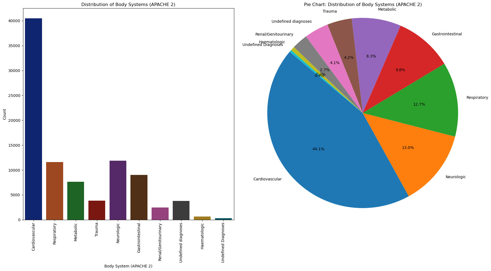
    


```python
# Scatter plot
plt.figure(figsize=(8, 6))
sns.scatterplot(data=df_project, x='age', y='bmi')
plt.title('Scatter plot of Age vs BMI')
plt.xlabel('Age')
plt.ylabel('BMI')
plt.show()
```


    
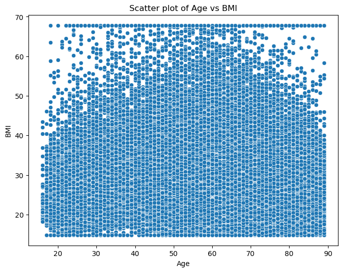
    


```python
# Count plot
plt.figure(figsize=(8, 6))
sns.countplot(data=df_project, x='gender')
plt.title('Distribution of Gender')
plt.xlabel('Gender')
plt.ylabel('Count')
plt.show()
```


    
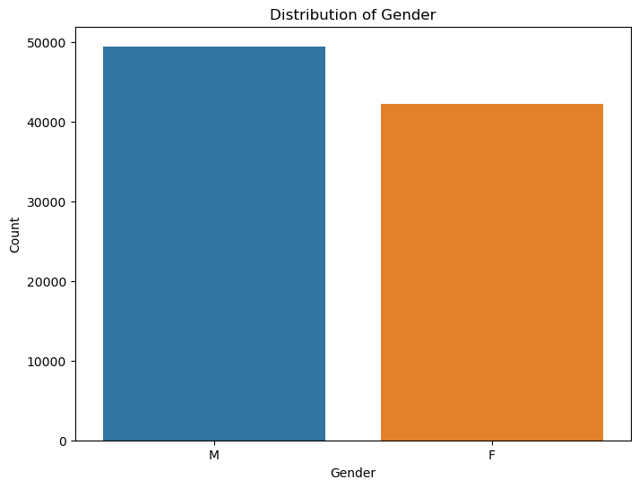
    


```python
# Correlation heatmap
plt.figure(figsize=(10, 8))
sns.heatmap(df_project.corr(), annot=True, cmap='coolwarm', fmt=".2f")
plt.title('Correlation Heatmap')
plt.show()
```


    
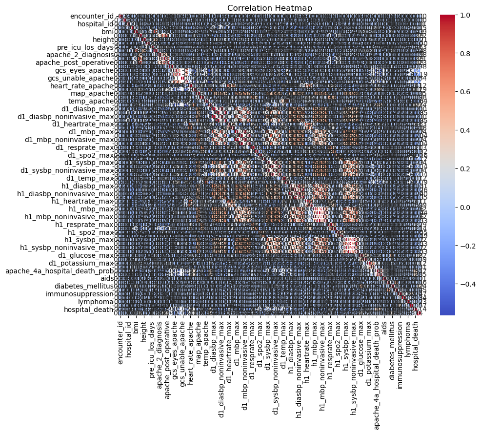
    


```python
plt.figure(figsize=(9, 7))
sns.heatmap(abs(df_project.corr())>0.75,cmap='Blues')
plt.show()
```


    
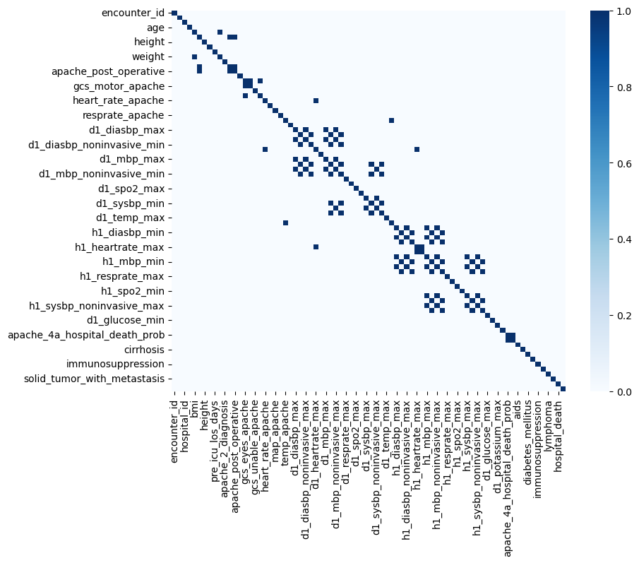
    


```python
fig, ax = plt.subplots(figsize=(10, 8))
sns.boxplot(data=df_project, x='apache_2_bodysystem', y='age', ax=ax, palette='dark')
ax.set_xlabel('Body System (APACHE 2)')
ax.set_ylabel('Age')
ax.set_title('Distribution of Age by Body Systems (APACHE 2)')
plt.xticks(rotation=90)
plt.show()
```


    

    


```python
fig, ax = plt.subplots(figsize=(10, 8))
sns.violinplot(data=df_project, x='apache_2_bodysystem', y='age', ax=ax, palette='dark')
ax.set_xlabel('Body System (APACHE 2)')
ax.set_ylabel('Age')
ax.set_title('Distribution of Age by Body Systems (APACHE 2)')
plt.xticks(rotation=90)
plt.show()
```


    

    


```python
plt.figure(figsize=(10, 6))
sns.heatmap(df_project.isnull(), cmap='viridis')
plt.title('Heatmap of Missing Values in DataFrame')
plt.show()
```


    
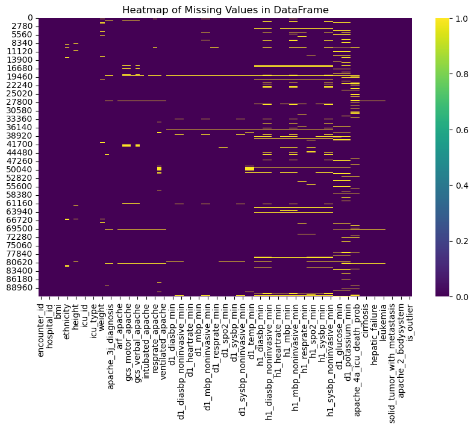
    


```python
from sklearn.impute import SimpleImputer

# Separate numeric and categorical features
numeric_features = df_project.select_dtypes(include=['int64', 'float64']).columns
categorical_features = df_project.select_dtypes(include=['object']).columns

# Impute missing values for numeric features
numeric_imputer = SimpleImputer(strategy='median')
df_project[numeric_features] = numeric_imputer.fit_transform(df_project[numeric_features])

# Impute missing values for categorical features
categorical_imputer = SimpleImputer(strategy='most_frequent')
df_project[categorical_features] = categorical_imputer.fit_transform(df_project[categorical_features])

# Check if any missing values remain
print(df_project.isnull().sum().sum())
```

    0


```python
plt.figure(figsize=(10, 6))
sns.heatmap(df_project.isnull(), cmap='viridis')
plt.title('Heatmap of Missing Values in DataFrame')
plt.show()
```


    
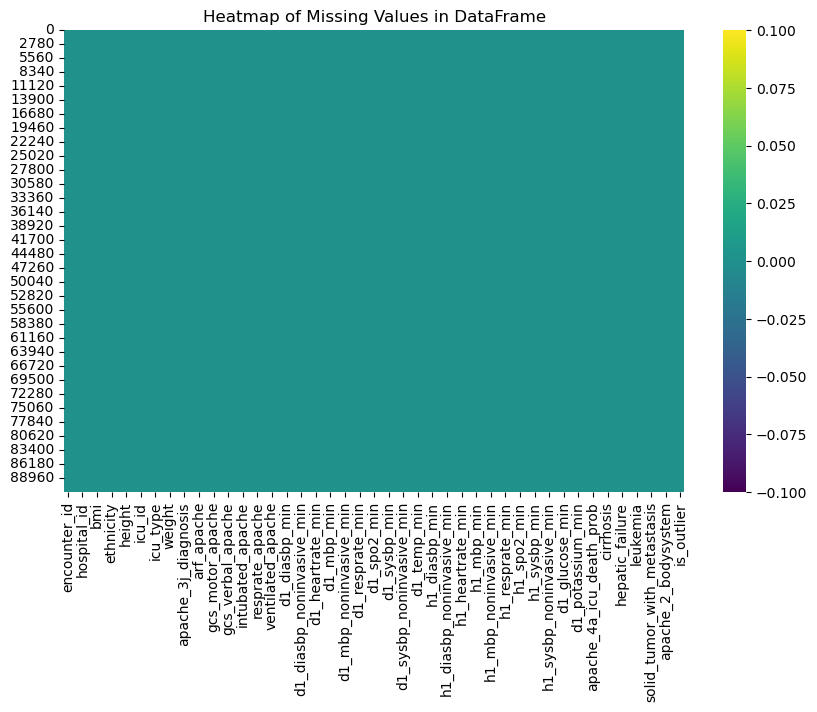
    


# MODELING

## Logistic Regression


```python
from sklearn.model_selection import train_test_split, GridSearchCV
from sklearn.pipeline import Pipeline
from sklearn.impute import SimpleImputer
from sklearn.preprocessing import StandardScaler, OneHotEncoder
from sklearn.compose import ColumnTransformer
from sklearn.linear_model import LogisticRegression,LinearRegression
```


```python
target = 'hospital_death'
numeric_features = df_project.select_dtypes(include=['int', 'float']).columns.tolist()
numeric_features.remove(target)  
categorical_features = df_project.select_dtypes(include=['object']).columns.tolist()
```


```python
# Define transformers
numeric_transformer = Pipeline(steps=[
    ('imputer', SimpleImputer(strategy='median')),
    ('scaler', StandardScaler())
])

categorical_transformer = Pipeline(steps=[
    ('imputer', SimpleImputer(strategy='constant', fill_value='missing')),
    ('onehot', OneHotEncoder(handle_unknown='ignore'))
])

# Define preprocessor
preprocessor = ColumnTransformer(
    transformers=[
        ('num', numeric_transformer, numeric_features),
        ('cat', categorical_transformer, categorical_features),
    ])

# Define the model pipeline
model_pipeline = Pipeline(steps=[
    ('preprocessor', preprocessor),
    ('model', LogisticRegression())
])
```


```python
X = df_project.drop(["hospital_death"],axis=1)
y = df_project['hospital_death']
```


```python
X_train, X_val, y_train, y_val = train_test_split(X, y, test_size=0.25, random_state=42)

model_pipeline.fit(X_train, y_train)
accuracy = model_pipeline.score(X_val, y_val)
y_pred = model_pipeline.predict(X_val)
```


```python
print("Model: LogisticRegression" )
print("Accuracy:", accuracy)
```

    Model: LogisticRegression
    Accuracy: 0.9239391164028087


```python
import warnings
warnings.filterwarnings("ignore")

from sklearn.linear_model import LogisticRegression
from sklearn.metrics import classification_report

# Assuming X_train and X_val are DataFrames containing your feature data
# Apply one-hot encoding to categorical variables in X_train and X_val
X_train_encoded = pd.get_dummies(X_train)
X_val_encoded = pd.get_dummies(X_val)

# Initialize logistic regression model
log_reg_model = LogisticRegression()

# Train the logistic regression model
log_reg_model.fit(X_train_encoded, y_train)

# Make predictions on the validation set
y_pred = log_reg_model.predict(X_val_encoded)

# Evaluate the model using classification report
report = classification_report(y_val, y_pred)

print("Classification Report for Logistic Regression Model:")
print(report)
```

    Classification Report for Logistic Regression Model:
                  precision    recall  f1-score   support
    
             0.0       0.92      1.00      0.96     20975
             1.0       0.56      0.01      0.03      1954
    
        accuracy                           0.92     22929
       macro avg       0.74      0.51      0.49     22929
    weighted avg       0.89      0.92      0.88     22929
    


```python
Dataset_row = df_project.iloc[[91611]]

if "hospital_death" in Dataset_row.columns:
    Dataset_row = Dataset_row.drop(columns=["hospital_death"])

# Make predictions
prediction = model_pipeline.predict(Dataset_row)
print("\n------------------------------------\n")
if prediction==0:
    print("\tPatient Death")
elif prediction==1:
    print("\tPatient Survived")
print("\n------------------------------------")
```

    
    ------------------------------------
    
    	Patient Death
    
    ------------------------------------


## Gradient Boosting Model


```python
from sklearn.model_selection import train_test_split
from sklearn.impute import SimpleImputer
from sklearn.preprocessing import OneHotEncoder
from sklearn.compose import ColumnTransformer
from sklearn.pipeline import Pipeline
import pandas as pd

target = 'hospital_death'

X = df_project.drop(columns=[target])
y = df_project[target]

numeric_features = X.select_dtypes(include=['int', 'float']).columns.tolist()
categorical_features = X.select_dtypes(include=['object']).columns.tolist()

# Define preprocessing steps for numeric and categorical features
numeric_transformer = Pipeline(steps=[
    ('imputer', SimpleImputer(strategy='median'))  # Handle missing values by imputing median
])

categorical_transformer = Pipeline(steps=[
    ('imputer', SimpleImputer(strategy='constant', fill_value='missing')),  # Handle missing values by imputing 'missing'
    ('onehot', OneHotEncoder(handle_unknown='ignore'))  # One-hot encode categorical variables
])

# Combine preprocessing steps for numeric and categorical features
preprocessor = ColumnTransformer(
    transformers=[
        ('num', numeric_transformer, numeric_features),
        ('cat', categorical_transformer, categorical_features)
    ])

# Step 2: Splitting the Data into Training and Testing Sets
X_train, X_test, y_train, y_test = train_test_split(X, y, test_size=0.2, random_state=42)

# Step 3: Model Initialization
from sklearn.ensemble import GradientBoostingClassifier

# Initialize Gradient Boosting model
gb_model = GradientBoostingClassifier(n_estimators=100, learning_rate=0.1, max_depth=3, random_state=42)

# Step 4: Model Training
# Fit the model to the training data
gb_model.fit(preprocessor.fit_transform(X_train), y_train)

# Step 5: Model Evaluation
from sklearn.metrics import accuracy_score, classification_report

# Make predictions on the testing data
y_pred = gb_model.predict(preprocessor.transform(X_test))

# Evaluate model performance
accuracy = accuracy_score(y_test, y_pred)
print("Accuracy:", accuracy)

# Additional evaluation metrics
print(classification_report(y_test, y_pred))
```

    Accuracy: 0.9264024423485798
                  precision    recall  f1-score   support
    
             0.0       0.94      0.99      0.96     16756
             1.0       0.67      0.30      0.41      1587
    
        accuracy                           0.93     18343
       macro avg       0.80      0.64      0.69     18343
    weighted avg       0.91      0.93      0.91     18343
    


```python
# Identify categorical features in your dataset
categorical_features = df_project.select_dtypes(include=['object']).columns

# Perform one-hot encoding on the categorical features
encoded_df = pd.get_dummies(df_project, columns=categorical_features, drop_first=True)

# Split the dataset into features (X) and target (y)
X = encoded_df.drop(columns=['hospital_death'])
y = encoded_df['hospital_death']

# Split the data into training and validation sets
X_train, X_val, y_train, y_val = train_test_split(X, y, test_size=0.25, random_state=42)

# Train the gradient boost classifier
gb_model.fit(X_train, y_train)

# Make predictions on the validation set
y_pred = gb_model.predict(X_val)

# Evaluate the model
print("Classification Report for Gradient Boosting Model:")
print(classification_report(y_val, y_pred))
```

    Classification Report for Gradient Boosting Model:
                  precision    recall  f1-score   support
    
             0.0       0.94      0.99      0.96     20975
             1.0       0.67      0.31      0.42      1954
    
        accuracy                           0.93     22929
       macro avg       0.80      0.65      0.69     22929
    weighted avg       0.92      0.93      0.92     22929
    


Class 0 (survival) has higher precision, recall, and F1-score compared to Class 1 (mortality).

* PRECISION:
For class 0 (survived), the precision is 0.94, indicating that out of all predicted survivals, 94% were correctly classified. 
For class 1 (deceased), the precision is 0.67, meaning that out of all predicted deaths, 67% were correctly classified.

* RECALL:
For class 0, the recall is 0.99, indicating that 99% of actual survivals were correctly classified. For class 1, the recall is 0.31, meaning that only 31% of actual deaths were correctly classified.

* F1 SCORE: 
For class 0, the F1-score is 0.96, indicating a good balance between precision and recall. For class 1, the F1-score is 0.42, suggesting a moderate balance between precision and recall.

* SUPPORT: (actual instances) 
For class 0, there are 20,975 instances, and for class 1, there are 1,954 instances.


```python
#Top N Most Important Features

# Separate features and target variable
X = encoded_df.drop(columns=['hospital_death'])
y = encoded_df['hospital_death']

# Fit the model to the data to obtain feature importances
gb_model.fit(X, y)

# Get feature importances
feature_importances = pd.Series(gb_model.feature_importances_, index=X.columns)

# Select the top N most important features
top_n = 10  # Change this to adjust the number of features to display
top_features = feature_importances.nlargest(top_n)

# Reset Matplotlib configuration to default
plt.rcParams.update(plt.rcParamsDefault)

# Plot a bar chart for the top features
plt.figure(figsize=(10, 6))
top_features.sort_values(ascending=True).plot(kind='barh') 
plt.xlabel('Feature Importance')
plt.ylabel('Feature')
plt.title(f'Top {top_n} Most Important Features for Gradient Boosting Model')
plt.show()
```


    
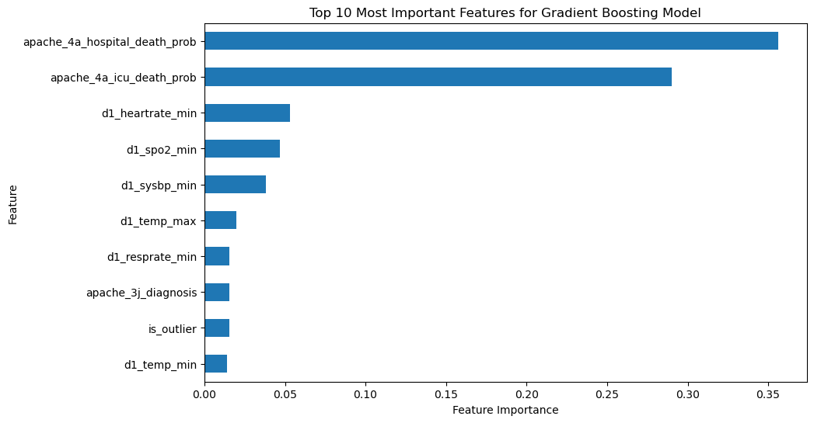
    


# Random Forest 

## Feature Engineering


```python
# Select the Top N Most Important Features
from sklearn.ensemble import RandomForestClassifier

# Separate features and target variable
X = encoded_df.drop(columns=['hospital_death'])
y = encoded_df['hospital_death']

# Initialize Random Forest model
rf_model = RandomForestClassifier(n_estimators=100, random_state=42)

# Fit the model to the data to obtain feature importances
rf_model.fit(X, y)

# Get feature importances
feature_importances = pd.Series(rf_model.feature_importances_, index=X.columns)

# Select the top N most important features
top_n = 10  # Change this to adjust the number of features to display
top_features = feature_importances.nlargest(top_n)

# Reset Matplotlib configuration to default
plt.rcParams.update(plt.rcParamsDefault)

# Plot a bar chart for the top features
plt.figure(figsize=(10, 6))
top_features.sort_values(ascending=True).plot(kind='barh')
plt.xlabel('Feature Importance')
plt.ylabel('Feature')
plt.title(f'Top {top_n} Most Important Features for Random Forest Model')
plt.show()
```


    
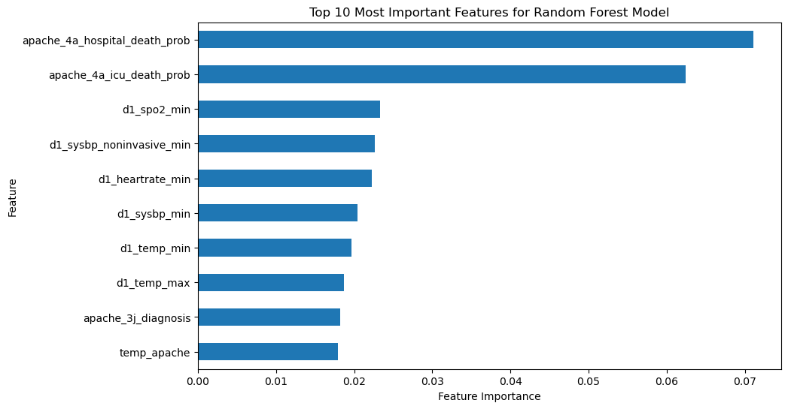
    


## Initializing Random Forest model (Using numerical features from feature engineering)


```python
from sklearn.ensemble import RandomForestClassifier
from sklearn.metrics import accuracy_score, classification_report, confusion_matrix
from sklearn.model_selection import train_test_split

# Selected features
selected_features = ['temp_apache', 'apache_3j_diagnosis', 'd1_temp_max', 'd1_temp_min', 
                     'd1_sysbp_min', 'd1_heartrate_min', 'd1_sysbp_noninvasive_min', 
                     'd1_spo2_min', 'apache_4a_icu_death_prob', 'apache_4a_hospital_death_prob']

# Subset the data with selected features
X_selected = X[selected_features]

# Split the data into training and testing sets
X_train, X_test, y_train, y_test = train_test_split(X_selected, y, test_size=0.2, random_state=42)

# Initialize and train the Random Forest model
rf_model = RandomForestClassifier(n_estimators=100, random_state=42)
rf_model.fit(X_train, y_train)

# Make predictions on the testing data
y_pred = rf_model.predict(X_test)
```


```python
# Evaluate the model
accuracy = accuracy_score(y_test, y_pred)
print("Accuracy:", accuracy)

# Classification report
print("\n Random Forest Classification Report:")
print(classification_report(y_test, y_pred))
```

    Accuracy: 0.9235130567518944
    
     Random Forest Classification Report:
                  precision    recall  f1-score   support
    
             0.0       0.93      0.98      0.96     16756
             1.0       0.63      0.28      0.38      1587
    
        accuracy                           0.92     18343
       macro avg       0.78      0.63      0.67     18343
    weighted avg       0.91      0.92      0.91     18343
    


- Accuracy: 92.31%

- Precision (Class 0): 93%
- Precision (Class 1): 63%

- Recall (Class 0): 98%
- Recall (Class 1): 27%

- F1-score (Class 0): 0.96
- F1-score (Class 1): 0.38

* In summary, the model demonstrates high accuracy in predicting survival instances (Class 0), but it has lower performance in predicting death instances (Class 1), as indicated by lower recall and precision scores.

* Accuracy: The model achieved an accuracy of approximately 92.31%, which is the proportion of correctly classified instances out of the total instances.

* Precision: Precision measures the proportion of true positive predictions out of all positive predictions. For class 0, precision is 0.93, indicating that 93% of the predicted survivals were actually survived. For class 1, precision is 0.63, meaning that 63% of the predicted deaths were actually deaths.

* Recall: Recall measures the proportion of true positive predictions out of all actual positives. For class 0, recall is 0.98, indicating that 98% of the actual survivals were correctly classified. For class 1, recall is 0.27, meaning that only 27% of the actual deaths were correctly classified.

* F1-score: The F1-score is the harmonic mean of precision and recall. It provides a balance between precision and recall. For class 0, the F1-score is 0.96, and for class 1, it is 0.38.


```python
from sklearn.metrics import mean_squared_error, mean_absolute_error, r2_score


# Calculate metrics
mse_rf = mean_squared_error(y_test, y_pred)
mae_rf = mean_absolute_error(y_test, y_pred)
r2_rf = r2_score(y_test, y_pred)

print(f"Random Forest Mean Squared Error: {mse_rf}")
print(f"Random Forest Mean Absolute Error: {mae_rf}")
print(f"Random Forest R-squared Score: {r2_rf}")
```

    Random Forest Mean Squared Error: 0.07648694324810554
    Random Forest Mean Absolute Error: 0.07648694324810554
    Random Forest R-squared Score: 0.03221082822160182


```python
import matplotlib.pyplot as plt
import seaborn as sns
from sklearn.metrics import confusion_matrix

conf_matrix = confusion_matrix(y_test,y_pred)

plt.figure(figsize=(8, 6))
sns.heatmap(conf_matrix, annot=True, fmt='d', cmap='Blues')
plt.xlabel('Predicted labels')
plt.ylabel('True labels')
plt.title('Confusion Matrix')
plt.show()
```


    
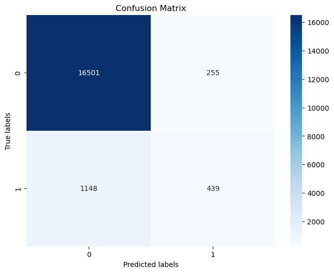
    


* Confusion Matrix: The confusion matrix shows the counts of true positive, false positive, true negative, and false negative predictions. In this case, there are 16500 true negative predictions (survivals correctly classified), 256 false positive predictions (deaths incorrectly classified as survivals), 1154 false negative predictions (survivals incorrectly classified as deaths), and 433 true positive predictions (deaths correctly classified).

Overall, the model performs well in classifying survival instances (class 0), but it struggles with classifying death instances (class 1), as evidenced by the lower recall and precision for class 1. 

# Random Forest


```python
from sklearn.ensemble import RandomForestClassifier
from sklearn.model_selection import train_test_split
from sklearn.metrics import accuracy_score
```


```python
from sklearn.preprocessing import OneHotEncoder

# Define categorical columns excluding 'ethnicity' and 'gender'
categorical_columns = ['gender', 'ethnicity','icu_admit_source', 'icu_stay_type', 'icu_type', 'apache_3j_bodysystem', 'apache_2_bodysystem']

# Extract categorical features
X_categorical = df_project[categorical_columns]

# Handle missing values by filling them with a placeholder value, such as 'Unknown'
X_categorical.fillna('Unknown', inplace=True)

# Perform one-hot encoding
encoder = OneHotEncoder(sparse=False, handle_unknown='ignore')
X_categorical_encoded = encoder.fit_transform(X_categorical)

# Create a DataFrame with encoded categorical features
X_categorical_encoded_df = pd.DataFrame(X_categorical_encoded, columns=encoder.get_feature_names_out(categorical_columns))

# Drop the original categorical columns from the DataFrame
df2 = df_project.drop(columns=categorical_columns)

# Concatenate the encoded categorical features with the original DataFrame
X = pd.concat([df2, X_categorical_encoded_df], axis=1)

# Drop any remaining rows with missing values
X.dropna(inplace=True)

# Separate features and target variable
target = 'hospital_death'
y = X[target]
X = X.drop(columns=[target])
```


```python
X_train, X_test, y_train, y_test = train_test_split(X, y, test_size=0.2, random_state=42)

# Initialize the RandomForestClassifier
rf_classifier = RandomForestClassifier(n_estimators=100, random_state=42)

# Fit the model to the training data
rf_classifier.fit(X_train, y_train)
```


    RandomForestClassifier(random_state=42)


```python
y_pred = rf_classifier.predict(X_test)
```


```python
# Calculate the accuracy of the classifier
accuracy = accuracy_score(y_test, y_pred)
print("Accuracy:", accuracy)
```

    Accuracy: 0.9260753420923513


```python
from sklearn.metrics import mean_squared_error, mean_absolute_error, r2_score


# Calculate metrics
mse_rf = mean_squared_error(y_test, y_pred)
mae_rf = mean_absolute_error(y_test, y_pred)
r2_rf = r2_score(y_test, y_pred)

print(f"Random Forest Mean Squared Error: {mse_rf}")
print(f"Random Forest Mean Absolute Error: {mae_rf}")
print(f"Random Forest R-squared Score: {r2_rf}")
```

    Random Forest Mean Squared Error: 0.0739246579076487
    Random Forest Mean Absolute Error: 0.0739246579076487
    Random Forest R-squared Score: 0.06463142057625948


## Create a series containing feature importances from the model and feature names from the training data


```python
feature_importances = pd.Series(rf_classifier.feature_importances_, index=X_train.columns).sort_values(ascending=False)

# Plot a simple bar chart
feature_importances.plot.bar(figsize=(14, 6), color='skyblue')
plt.title('Feature Importances')
plt.xlabel('Features')
plt.ylabel('Importance')
plt.tight_layout
plt.show()
```


    
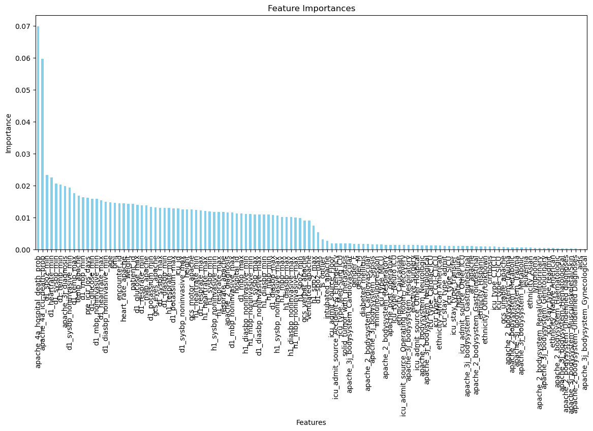
    


# Tree Model


```python
df_project.info()
```

    <class 'pandas.core.frame.DataFrame'>
    RangeIndex: 91713 entries, 0 to 91712
    Data columns (total 85 columns):
     #   Column                         Non-Null Count  Dtype  
    ---  ------                         --------------  -----  
     0   encounter_id                   91713 non-null  float64
     1   patient_id                     91713 non-null  float64
     2   hospital_id                    91713 non-null  float64
     3   age                            91713 non-null  float64
     4   bmi                            91713 non-null  float64
     5   elective_surgery               91713 non-null  float64
     6   ethnicity                      91713 non-null  object 
     7   gender                         91713 non-null  object 
     8   height                         91713 non-null  float64
     9   icu_admit_source               91713 non-null  object 
     10  icu_id                         91713 non-null  float64
     11  icu_stay_type                  91713 non-null  object 
     12  icu_type                       91713 non-null  object 
     13  pre_icu_los_days               91713 non-null  float64
     14  weight                         91713 non-null  float64
     15  apache_2_diagnosis             91713 non-null  float64
     16  apache_3j_diagnosis            91713 non-null  float64
     17  apache_post_operative          91713 non-null  float64
     18  arf_apache                     91713 non-null  float64
     19  gcs_eyes_apache                91713 non-null  float64
     20  gcs_motor_apache               91713 non-null  float64
     21  gcs_unable_apache              91713 non-null  float64
     22  gcs_verbal_apache              91713 non-null  float64
     23  heart_rate_apache              91713 non-null  float64
     24  intubated_apache               91713 non-null  float64
     25  map_apache                     91713 non-null  float64
     26  resprate_apache                91713 non-null  float64
     27  temp_apache                    91713 non-null  float64
     28  ventilated_apache              91713 non-null  float64
     29  d1_diasbp_max                  91713 non-null  float64
     30  d1_diasbp_min                  91713 non-null  float64
     31  d1_diasbp_noninvasive_max      91713 non-null  float64
     32  d1_diasbp_noninvasive_min      91713 non-null  float64
     33  d1_heartrate_max               91713 non-null  float64
     34  d1_heartrate_min               91713 non-null  float64
     35  d1_mbp_max                     91713 non-null  float64
     36  d1_mbp_min                     91713 non-null  float64
     37  d1_mbp_noninvasive_max         91713 non-null  float64
     38  d1_mbp_noninvasive_min         91713 non-null  float64
     39  d1_resprate_max                91713 non-null  float64
     40  d1_resprate_min                91713 non-null  float64
     41  d1_spo2_max                    91713 non-null  float64
     42  d1_spo2_min                    91713 non-null  float64
     43  d1_sysbp_max                   91713 non-null  float64
     44  d1_sysbp_min                   91713 non-null  float64
     45  d1_sysbp_noninvasive_max       91713 non-null  float64
     46  d1_sysbp_noninvasive_min       91713 non-null  float64
     47  d1_temp_max                    91713 non-null  float64
     48  d1_temp_min                    91713 non-null  float64
     49  h1_diasbp_max                  91713 non-null  float64
     50  h1_diasbp_min                  91713 non-null  float64
     51  h1_diasbp_noninvasive_max      91713 non-null  float64
     52  h1_diasbp_noninvasive_min      91713 non-null  float64
     53  h1_heartrate_max               91713 non-null  float64
     54  h1_heartrate_min               91713 non-null  float64
     55  h1_mbp_max                     91713 non-null  float64
     56  h1_mbp_min                     91713 non-null  float64
     57  h1_mbp_noninvasive_max         91713 non-null  float64
     58  h1_mbp_noninvasive_min         91713 non-null  float64
     59  h1_resprate_max                91713 non-null  float64
     60  h1_resprate_min                91713 non-null  float64
     61  h1_spo2_max                    91713 non-null  float64
     62  h1_spo2_min                    91713 non-null  float64
     63  h1_sysbp_max                   91713 non-null  float64
     64  h1_sysbp_min                   91713 non-null  float64
     65  h1_sysbp_noninvasive_max       91713 non-null  float64
     66  h1_sysbp_noninvasive_min       91713 non-null  float64
     67  d1_glucose_max                 91713 non-null  float64
     68  d1_glucose_min                 91713 non-null  float64
     69  d1_potassium_max               91713 non-null  float64
     70  d1_potassium_min               91713 non-null  float64
     71  apache_4a_hospital_death_prob  91713 non-null  float64
     72  apache_4a_icu_death_prob       91713 non-null  float64
     73  aids                           91713 non-null  float64
     74  cirrhosis                      91713 non-null  float64
     75  diabetes_mellitus              91713 non-null  float64
     76  hepatic_failure                91713 non-null  float64
     77  immunosuppression              91713 non-null  float64
     78  leukemia                       91713 non-null  float64
     79  lymphoma                       91713 non-null  float64
     80  solid_tumor_with_metastasis    91713 non-null  float64
     81  apache_3j_bodysystem           91713 non-null  object 
     82  apache_2_bodysystem            91713 non-null  object 
     83  hospital_death                 91713 non-null  float64
     84  is_outlier                     91713 non-null  float64
    dtypes: float64(78), object(7)
    memory usage: 59.5+ MB


```python
import pandas as pd

# Assuming df is your DataFrame
clean_df = df_project.dropna()
```


```python
clean_df.info()
```

    <class 'pandas.core.frame.DataFrame'>
    RangeIndex: 91713 entries, 0 to 91712
    Data columns (total 85 columns):
     #   Column                         Non-Null Count  Dtype  
    ---  ------                         --------------  -----  
     0   encounter_id                   91713 non-null  float64
     1   patient_id                     91713 non-null  float64
     2   hospital_id                    91713 non-null  float64
     3   age                            91713 non-null  float64
     4   bmi                            91713 non-null  float64
     5   elective_surgery               91713 non-null  float64
     6   ethnicity                      91713 non-null  object 
     7   gender                         91713 non-null  object 
     8   height                         91713 non-null  float64
     9   icu_admit_source               91713 non-null  object 
     10  icu_id                         91713 non-null  float64
     11  icu_stay_type                  91713 non-null  object 
     12  icu_type                       91713 non-null  object 
     13  pre_icu_los_days               91713 non-null  float64
     14  weight                         91713 non-null  float64
     15  apache_2_diagnosis             91713 non-null  float64
     16  apache_3j_diagnosis            91713 non-null  float64
     17  apache_post_operative          91713 non-null  float64
     18  arf_apache                     91713 non-null  float64
     19  gcs_eyes_apache                91713 non-null  float64
     20  gcs_motor_apache               91713 non-null  float64
     21  gcs_unable_apache              91713 non-null  float64
     22  gcs_verbal_apache              91713 non-null  float64
     23  heart_rate_apache              91713 non-null  float64
     24  intubated_apache               91713 non-null  float64
     25  map_apache                     91713 non-null  float64
     26  resprate_apache                91713 non-null  float64
     27  temp_apache                    91713 non-null  float64
     28  ventilated_apache              91713 non-null  float64
     29  d1_diasbp_max                  91713 non-null  float64
     30  d1_diasbp_min                  91713 non-null  float64
     31  d1_diasbp_noninvasive_max      91713 non-null  float64
     32  d1_diasbp_noninvasive_min      91713 non-null  float64
     33  d1_heartrate_max               91713 non-null  float64
     34  d1_heartrate_min               91713 non-null  float64
     35  d1_mbp_max                     91713 non-null  float64
     36  d1_mbp_min                     91713 non-null  float64
     37  d1_mbp_noninvasive_max         91713 non-null  float64
     38  d1_mbp_noninvasive_min         91713 non-null  float64
     39  d1_resprate_max                91713 non-null  float64
     40  d1_resprate_min                91713 non-null  float64
     41  d1_spo2_max                    91713 non-null  float64
     42  d1_spo2_min                    91713 non-null  float64
     43  d1_sysbp_max                   91713 non-null  float64
     44  d1_sysbp_min                   91713 non-null  float64
     45  d1_sysbp_noninvasive_max       91713 non-null  float64
     46  d1_sysbp_noninvasive_min       91713 non-null  float64
     47  d1_temp_max                    91713 non-null  float64
     48  d1_temp_min                    91713 non-null  float64
     49  h1_diasbp_max                  91713 non-null  float64
     50  h1_diasbp_min                  91713 non-null  float64
     51  h1_diasbp_noninvasive_max      91713 non-null  float64
     52  h1_diasbp_noninvasive_min      91713 non-null  float64
     53  h1_heartrate_max               91713 non-null  float64
     54  h1_heartrate_min               91713 non-null  float64
     55  h1_mbp_max                     91713 non-null  float64
     56  h1_mbp_min                     91713 non-null  float64
     57  h1_mbp_noninvasive_max         91713 non-null  float64
     58  h1_mbp_noninvasive_min         91713 non-null  float64
     59  h1_resprate_max                91713 non-null  float64
     60  h1_resprate_min                91713 non-null  float64
     61  h1_spo2_max                    91713 non-null  float64
     62  h1_spo2_min                    91713 non-null  float64
     63  h1_sysbp_max                   91713 non-null  float64
     64  h1_sysbp_min                   91713 non-null  float64
     65  h1_sysbp_noninvasive_max       91713 non-null  float64
     66  h1_sysbp_noninvasive_min       91713 non-null  float64
     67  d1_glucose_max                 91713 non-null  float64
     68  d1_glucose_min                 91713 non-null  float64
     69  d1_potassium_max               91713 non-null  float64
     70  d1_potassium_min               91713 non-null  float64
     71  apache_4a_hospital_death_prob  91713 non-null  float64
     72  apache_4a_icu_death_prob       91713 non-null  float64
     73  aids                           91713 non-null  float64
     74  cirrhosis                      91713 non-null  float64
     75  diabetes_mellitus              91713 non-null  float64
     76  hepatic_failure                91713 non-null  float64
     77  immunosuppression              91713 non-null  float64
     78  leukemia                       91713 non-null  float64
     79  lymphoma                       91713 non-null  float64
     80  solid_tumor_with_metastasis    91713 non-null  float64
     81  apache_3j_bodysystem           91713 non-null  object 
     82  apache_2_bodysystem            91713 non-null  object 
     83  hospital_death                 91713 non-null  float64
     84  is_outlier                     91713 non-null  float64
    dtypes: float64(78), object(7)
    memory usage: 59.5+ MB


```python
plt.figure(figsize=(10, 6))
sns.heatmap(clean_df.isnull(), cmap='viridis')
plt.title('Heatmap of Missing Values in DataFrame')
plt.show()
```


    

    


## Randomly split the entire data into training (e.g., 50%) and test (e.g., 50%) data.

## Feature Importance for DecisionTreeClassifier


```python
from sklearn.tree import DecisionTreeClassifier

# Separate features and target variable
X = encoded_df.drop(columns=['hospital_death'])
y = encoded_df['hospital_death']

# Initialize Decision Tree model
dt_model = DecisionTreeClassifier(random_state=42)

# Fit the model to the data to obtain feature importances
dt_model.fit(X, y)

# Get feature importances
feature_importances = pd.Series(dt_model.feature_importances_, index=X.columns)

# Select the top N most important features
top_n = 10  # Change this to adjust the number of features to display
top_features = feature_importances.nlargest(top_n)

# Plot a bar chart for the top features in descending order
plt.figure(figsize=(10, 6))
top_features.sort_values(ascending=True).plot(kind='barh')  # Sort in ascending order
plt.xlabel('Feature Importance')
plt.ylabel('Feature')
plt.title(f'Top {top_n} Most Important Features (Decision Tree)')
plt.show()
```


    
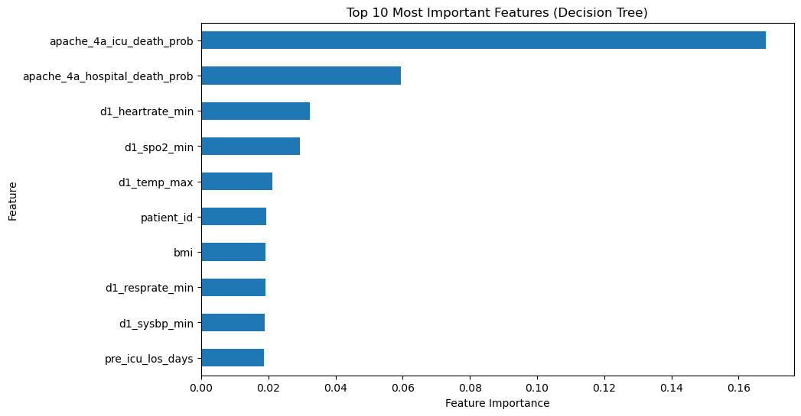
    


## Model 1: symptoms+apache 4a icu death probability


```python
import pandas as pd
from sklearn.model_selection import train_test_split

# Assuming df_project is your DataFrame
y = clean_df['hospital_death']
X = clean_df[['diabetes_mellitus', 'immunosuppression', 'leukemia', 'lymphoma', 'solid_tumor_with_metastasis','apache_4a_icu_death_prob']]

# Splitting the data
X_train, X_test, y_train, y_test = train_test_split(X, y, test_size=0.50, random_state=1324)

```


```python
# fit classification tree
from sklearn.model_selection import cross_val_score
from sklearn.tree import DecisionTreeClassifier
from sklearn.metrics import accuracy_score 

dtc = DecisionTreeClassifier(criterion='entropy', random_state=0) # default setting: criterion='gini'
dtc_model=dtc.fit(X_train,y_train)
```


```python
import matplotlib.pyplot as plt
from sklearn.tree import plot_tree

# Convert class labels to strings
cn = [str(label) for label in dtc_model.classes_]

# Rest of your code
fn = list(X_train.columns)  # Specify feature names

plt.figure(figsize=(16, 12))
plot_tree(dtc_model, feature_names=fn, class_names=cn, filled=True, proportion=True);
```


```python
# evaluate in the test data
y_pred=dtc_model.predict(X_test)
print("Plain accuracy of Classification Tree: ",accuracy_score(y_test, y_pred))
```

    Plain accuracy of Classification Tree:  0.9192925834659921


```python
# tune max_depth
scores_list = []
depth_list = np.arange(1,10,1)
for depth in depth_list:
    dtc = DecisionTreeClassifier(max_depth=depth, criterion='entropy',random_state=0) 
    model=dtc.fit(X_train,y_train)
    scores = cross_val_score(model,X_train,y_train,cv=10,scoring='accuracy') 
    scores_list.append(scores.mean())

plt.plot(depth_list, scores_list,  color = 'blue', markerfacecolor = 'black',label = 'Score')
plt.title('Accuracy Score vs max_depth')
plt.show()

index = np.argmax(np.array(scores_list))
depth_best = depth_list[index]
print('The best max_depth by cross-validation is ', depth_best)
```


    
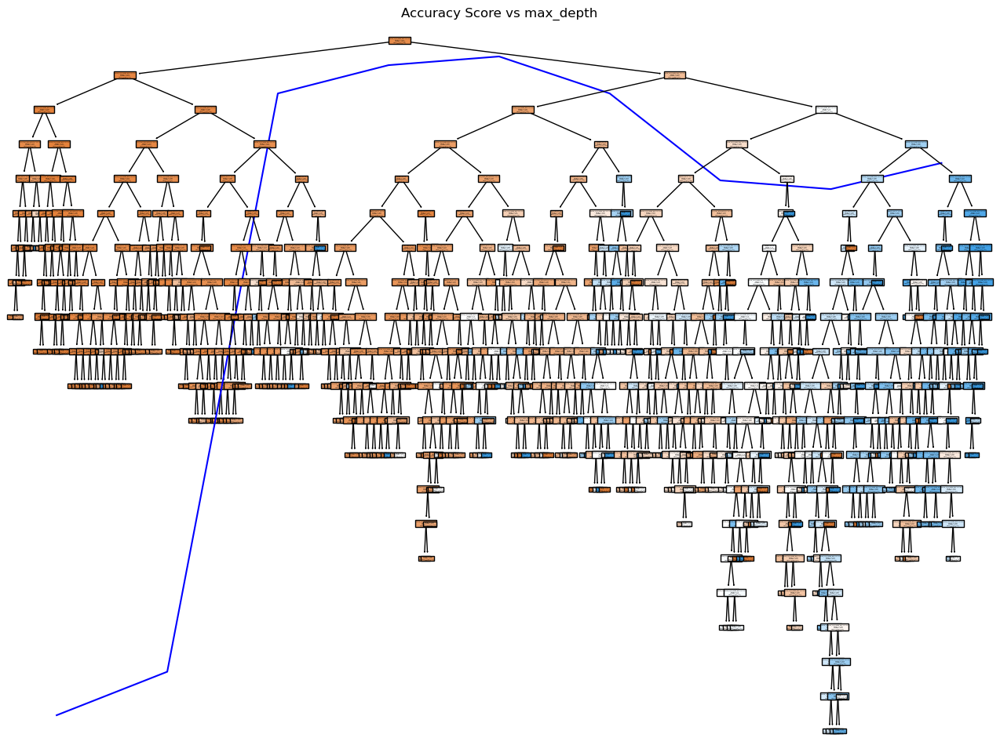
    


    The best max_depth by cross-validation is  5


```python
# set max_depth
dtc = DecisionTreeClassifier(max_depth=5, criterion='entropy',random_state=0) 
dtc_model = dtc.fit(X_train, y_train)

# Visualize classification tree
import matplotlib.pyplot as plt
from sklearn.tree import plot_tree

fn = list(X_train.columns)  # specify feature names
cn = [str(label) for label in dtc_model.classes_]  # convert class labels to strings

plt.figure(figsize=(16, 12))
plot_tree(dtc_model, feature_names=fn, class_names=cn, filled=True, proportion=True);
```


```python
# evaluate in the test data
y_pred=dtc_model.predict(X_test)
print("Plain accuracy of Classification Tree: ",accuracy_score(y_test, y_pred))
```

    Plain accuracy of Classification Tree:  0.921473275617681


```python
# check the test instance
X_test.iloc[0]
```


    diabetes_mellitus              0.0
    immunosuppression              0.0
    leukemia                       0.0
    lymphoma                       0.0
    solid_tumor_with_metastasis    0.0
    apache_4a_icu_death_prob       0.0
    Name: 56291, dtype: float64


```python
# the class probabilies for the first sample in the test data
y_prob=dtc_model.predict_proba(X_test.iloc[[0]])
print(y_prob)
```

    [[0.99810964 0.00189036]]


```python
# Evaluate using the test data
from sklearn.metrics import confusion_matrix
from sklearn.metrics import ConfusionMatrixDisplay
from sklearn.ensemble import RandomForestClassifier
from sklearn.metrics import accuracy_score, classification_report, confusion_matrix
from sklearn.model_selection import train_test_split

y_pred = dtc_model.predict(X_test)
cm = confusion_matrix(y_test, y_pred, labels=dtc.classes_)
disp = ConfusionMatrixDisplay(confusion_matrix=cm, display_labels=dtc.classes_)
disp.plot()
plt.show()
```


    
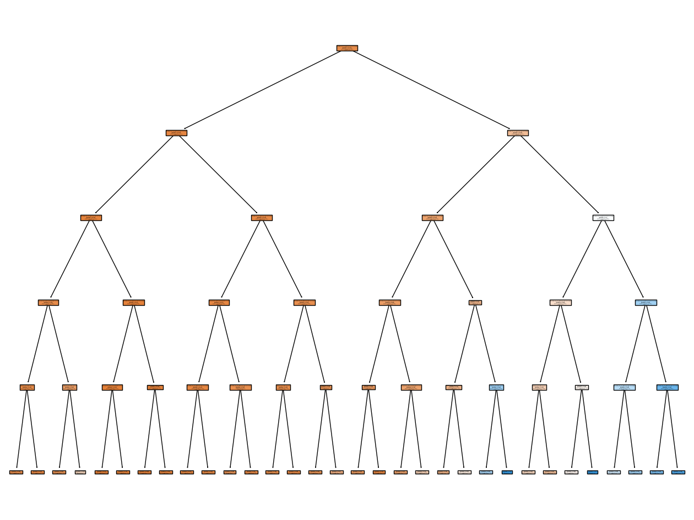
    


    

    


```python
accuracy = accuracy_score(y_test, y_pred)
print("Accuracy:", accuracy)

# Classification report
print("\nClassification Report:")
print(classification_report(y_test, y_pred))
```

    Accuracy: 0.921473275617681
    
    Classification Report:
                  precision    recall  f1-score   support
    
             0.0       0.93      0.99      0.96     41900
             1.0       0.67      0.18      0.28      3957
    
        accuracy                           0.92     45857
       macro avg       0.80      0.58      0.62     45857
    weighted avg       0.91      0.92      0.90     45857
    


```python
###svc
```


```python
import pandas as pd
from sklearn.model_selection import train_test_split, cross_val_score, KFold  # Import model_selection
from sklearn.linear_model import LogisticRegression
from sklearn.svm import SVC
from sklearn.tree import DecisionTreeClassifier
from sklearn.metrics import roc_auc_score


# Assuming df_project is your DataFrame
y = clean_df['hospital_death']
X = clean_df[['diabetes_mellitus', 'immunosuppression', 'leukemia', 'lymphoma', 'solid_tumor_with_metastasis','apache_4a_icu_death_prob']]

# Splitting the data
X_train, X_test, y_train, y_test = train_test_split(X, y, test_size=0.50, random_state=1324)

# Initialize classifiers in consideration
models = []
models.append(('Logistic Regression', LogisticRegression()))
models.append(('SVC', SVC(kernel='linear')))
models.append(('Decision Tree Classifier', DecisionTreeClassifier(max_depth=5, criterion='entropy', random_state=0)))
models.append(('Gradient Boosting Classifier', GradientBoostingClassifier(random_state=0)))
models.append(('Random Forest Classifier', RandomForestClassifier(random_state=0)))

# Evaluating Model Results:
acc_results = []
auc_results = []
names = []
# set table to table to populate with performance results
col = ['Algorithm', 'AUC Mean', 'AUC STD', 'Accuracy Mean', 'Accuracy STD']
model_results = pd.DataFrame(columns=col)

# Evaluate each model using k-fold cross-validation:
i = 0
for name, model in models:
    kfold = KFold(n_splits=3)  # Use KFold directly from sklearn.model_selection
    # accuracy scoring:
    cv_acc_results = cross_val_score(model, X_train, y_train, cv=kfold, scoring='accuracy')
    # roc_auc scoring:
    cv_auc_results = cross_val_score(model, X_train, y_train, cv=kfold, scoring='roc_auc')
    acc_results.append(cv_acc_results)
    auc_results.append(cv_auc_results)
    names.append(name)
    model_results.loc[i] = [name,
                         round(cv_auc_results.mean()*100, 2),
                         round(cv_auc_results.std()*100, 2),
                         round(cv_acc_results.mean()*100, 2),
                         round(cv_acc_results.std()*100, 2)
                         ]
    i += 1
    
model_results.sort_values(by=['AUC Mean'], ascending=False)

```


<div>
<style scoped>
    .dataframe tbody tr th:only-of-type {
        vertical-align: middle;
    }

    .dataframe tbody tr th {
        vertical-align: top;
    }

    .dataframe thead th {
        text-align: right;
    }
</style>
<table border="1" class="dataframe">
  <thead>
    <tr style="text-align: right;">
      <th></th>
      <th>Algorithm</th>
      <th>AUC Mean</th>
      <th>AUC STD</th>
      <th>Accuracy Mean</th>
      <th>Accuracy STD</th>
    </tr>
  </thead>
  <tbody>
    <tr>
      <th>3</th>
      <td>Gradient Boosting Classifier</td>
      <td>83.70</td>
      <td>0.29</td>
      <td>91.96</td>
      <td>0.09</td>
    </tr>
    <tr>
      <th>2</th>
      <td>Decision Tree Classifier</td>
      <td>83.29</td>
      <td>0.19</td>
      <td>91.99</td>
      <td>0.01</td>
    </tr>
    <tr>
      <th>4</th>
      <td>Random Forest Classifier</td>
      <td>82.27</td>
      <td>0.29</td>
      <td>91.74</td>
      <td>0.08</td>
    </tr>
    <tr>
      <th>0</th>
      <td>Logistic Regression</td>
      <td>81.22</td>
      <td>0.12</td>
      <td>92.04</td>
      <td>0.07</td>
    </tr>
    <tr>
      <th>1</th>
      <td>SVC</td>
      <td>73.22</td>
      <td>3.95</td>
      <td>91.37</td>
      <td>0.08</td>
    </tr>
  </tbody>
</table>
</div>


```python
# Assuming 'decision tree' is your selected Decision Tree Classifier model
decision_tree_model = DecisionTreeClassifier(max_depth=5, criterion='entropy', random_state=0)  # Initialize Decision Tree Classifier model
decision_tree_model.fit(X_train, y_train)  # Fit the model to the training data

# Calculate AUC score using the specified method
auc_score = roc_auc_score(y_test, decision_tree_model.predict_proba(X_test)[:, 1])

print("Final out-of-sample performance measured by Decision Tree Classifier AUC:", auc_score)
```

    Final out-of-sample performance measured by Decision Tree Classifier AUC: 0.8356296234641731


## Model 2: symptoms+'apache_4a_hospital_death_prob'


```python
import pandas as pd
from sklearn.model_selection import train_test_split

# Assuming df_project is your DataFrame
y = clean_df['hospital_death']
X = clean_df[['diabetes_mellitus', 'immunosuppression', 'leukemia', 'lymphoma', 'solid_tumor_with_metastasis','apache_4a_hospital_death_prob']]

# Splitting the data
X_train, X_test, y_train, y_test = train_test_split(X, y, test_size=0.50, random_state=1324)
```


```python
# fit classification tree
from sklearn.model_selection import cross_val_score
from sklearn.tree import DecisionTreeClassifier
from sklearn.metrics import accuracy_score 

dtc = DecisionTreeClassifier(criterion='entropy', random_state=0) # default setting: criterion='gini'
dtc_model=dtc.fit(X_train,y_train)
```


```python
import matplotlib.pyplot as plt
from sklearn.tree import plot_tree

# Convert class labels to strings
cn = [str(label) for label in dtc_model.classes_]

# Rest of your code
fn = list(X_train.columns)  # Specify feature names

plt.figure(figsize=(16, 12))
plot_tree(dtc_model, feature_names=fn, class_names=cn, filled=True, proportion=True);
```


```python
# evaluate in the test data
y_pred=dtc_model.predict(X_test)
print("Plain accuracy of Classification Tree: ",accuracy_score(y_test, y_pred))
```

    Plain accuracy of Classification Tree:  0.9199685980330157


```python
# tune max_depth
scores_list = []
depth_list = np.arange(1,10,1)
for depth in depth_list:
    dtc = DecisionTreeClassifier(max_depth=depth, criterion='entropy',random_state=0) 
    model=dtc.fit(X_train,y_train)
    scores = cross_val_score(model,X_train,y_train,cv=10,scoring='accuracy') 
    scores_list.append(scores.mean())

plt.plot(depth_list, scores_list,  color = 'blue', markerfacecolor = 'black',label = 'Score')
plt.title('Accuracy Score vs max_depth')
plt.show()

index = np.argmax(np.array(scores_list))
depth_best = depth_list[index]
print('The best max_depth by cross-validation is ', depth_best)
```


    
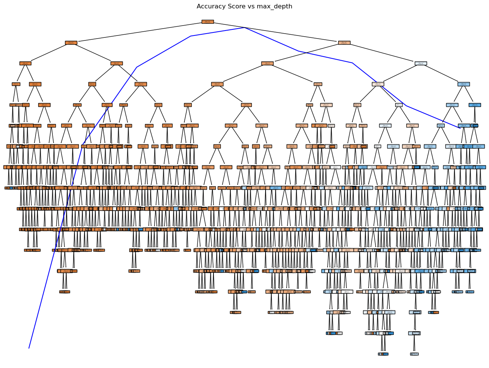
    


    The best max_depth by cross-validation is  5


```python
# set max_depth
dtc = DecisionTreeClassifier(max_depth=2, criterion='entropy',random_state=0) 
dtc_model = dtc.fit(X_train, y_train)

# Visualize classification tree
import matplotlib.pyplot as plt 
from sklearn.tree import plot_tree

fn = list(X_train.columns)  # specify feature names
cn = [str(label) for label in dtc_model.classes_]  # convert class labels to strings

plt.figure(figsize=(16, 12))
plot_tree(dtc_model, feature_names=fn, class_names=cn, filled=True, proportion=True);
```


```python
# check the test instance
X_test.iloc[0]
```


    diabetes_mellitus                0.00
    immunosuppression                0.00
    leukemia                         0.00
    lymphoma                         0.00
    solid_tumor_with_metastasis      0.00
    apache_4a_hospital_death_prob    0.01
    Name: 56291, dtype: float64


```python
# the class probabilies for the first sample in the test data
y_prob=dtc_model.predict_proba(X_test.iloc[[0]])
print(y_prob)
```

    [[0.98495896 0.01504104]]


```python
# Evaluate using the test data
from sklearn.metrics import confusion_matrix
from sklearn.metrics import ConfusionMatrixDisplay

y_pred = dtc_model.predict(X_test)
cm = confusion_matrix(y_test, y_pred, labels=dtc.classes_)
disp = ConfusionMatrixDisplay(confusion_matrix=cm, display_labels=dtc.classes_)
disp.plot()
plt.show()
```


    
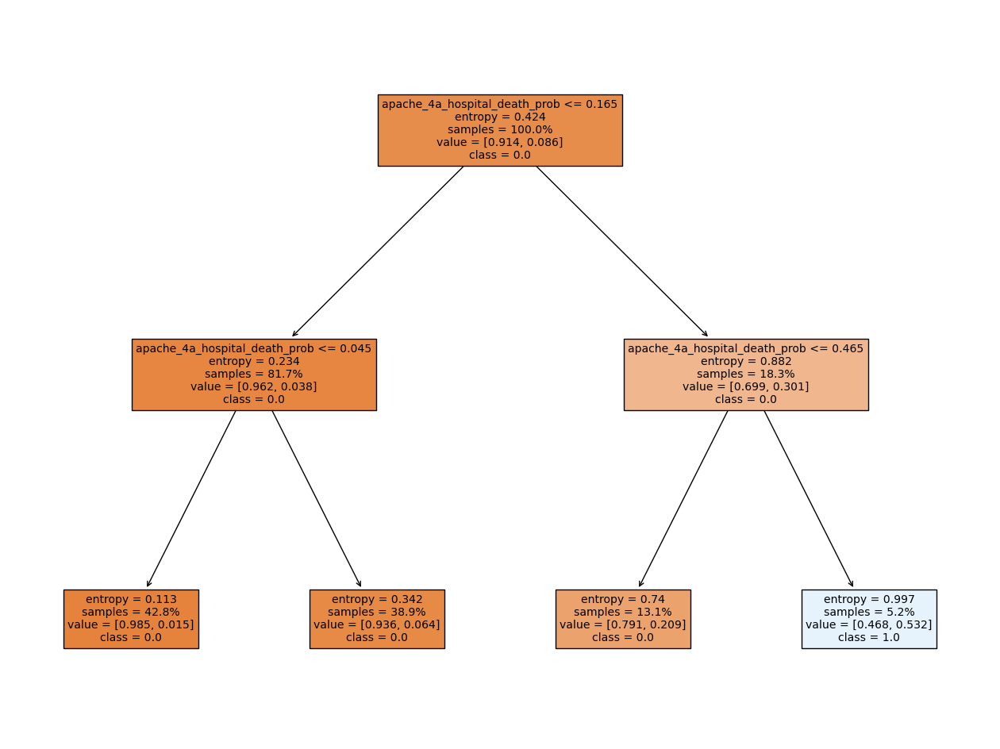
    


    

    


```python
accuracy = accuracy_score(y_test, y_pred)
print("Accuracy:", accuracy)

# Classification report
print("\nClassification Report:")
print(classification_report(y_test, y_pred))
```

    Accuracy: 0.917722485116776
    
    Classification Report:
                  precision    recall  f1-score   support
    
             0.0       0.94      0.97      0.96     41900
             1.0       0.54      0.33      0.41      3957
    
        accuracy                           0.92     45857
       macro avg       0.74      0.65      0.68     45857
    weighted avg       0.90      0.92      0.91     45857
    


```python
import pandas as pd
from sklearn.model_selection import train_test_split, cross_val_score, KFold  # Import model_selection
from sklearn.linear_model import LogisticRegression
from sklearn.svm import SVC
from sklearn.tree import DecisionTreeClassifier

# Assuming df_project is your DataFrame
y = clean_df['hospital_death']
X = clean_df[['diabetes_mellitus', 'immunosuppression', 'leukemia', 'lymphoma', 'solid_tumor_with_metastasis','apache_4a_hospital_death_prob']]

# Splitting the data
X_train, X_test, y_train, y_test = train_test_split(X, y, test_size=0.50, random_state=1324)

# Initialize classifiers in consideration
models = []
models.append(('Logistic Regression', LogisticRegression()))
models.append(('SVC', SVC(kernel='linear')))
models.append(('Decision Tree Classifier', DecisionTreeClassifier(max_depth=5, criterion='entropy', random_state=0)))
models.append(('Gradient Boosting Classifier', GradientBoostingClassifier(random_state=0)))
models.append(('Random Forest Classifier', RandomForestClassifier(random_state=0)))

# Evaluating Model Results:
acc_results = []
auc_results = []
names = []
# set table to table to populate with performance results
col = ['Algorithm', 'AUC Mean', 'AUC STD', 'Accuracy Mean', 'Accuracy STD']
model_results = pd.DataFrame(columns=col)

# Evaluate each model using k-fold cross-validation:
i = 0
for name, model in models:
    kfold = KFold(n_splits=3)  # Use KFold directly from sklearn.model_selection
    # accuracy scoring:
    cv_acc_results = cross_val_score(model, X_train, y_train, cv=kfold, scoring='accuracy')
    # roc_auc scoring:
    cv_auc_results = cross_val_score(model, X_train, y_train, cv=kfold, scoring='roc_auc')
    acc_results.append(cv_acc_results)
    auc_results.append(cv_auc_results)
    names.append(name)
    model_results.loc[i] = [name,
                         round(cv_auc_results.mean()*100, 2),
                         round(cv_auc_results.std()*100, 2),
                         round(cv_acc_results.mean()*100, 2),
                         round(cv_acc_results.std()*100, 2)
                         ]
    i += 1
    
model_results.sort_values(by=['AUC Mean'], ascending=False)

```


<div>
<style scoped>
    .dataframe tbody tr th:only-of-type {
        vertical-align: middle;
    }

    .dataframe tbody tr th {
        vertical-align: top;
    }

    .dataframe thead th {
        text-align: right;
    }
</style>
<table border="1" class="dataframe">
  <thead>
    <tr style="text-align: right;">
      <th></th>
      <th>Algorithm</th>
      <th>AUC Mean</th>
      <th>AUC STD</th>
      <th>Accuracy Mean</th>
      <th>Accuracy STD</th>
    </tr>
  </thead>
  <tbody>
    <tr>
      <th>3</th>
      <td>Gradient Boosting Classifier</td>
      <td>84.17</td>
      <td>0.43</td>
      <td>92.03</td>
      <td>0.10</td>
    </tr>
    <tr>
      <th>2</th>
      <td>Decision Tree Classifier</td>
      <td>83.75</td>
      <td>0.59</td>
      <td>92.04</td>
      <td>0.10</td>
    </tr>
    <tr>
      <th>4</th>
      <td>Random Forest Classifier</td>
      <td>82.92</td>
      <td>0.40</td>
      <td>91.76</td>
      <td>0.15</td>
    </tr>
    <tr>
      <th>0</th>
      <td>Logistic Regression</td>
      <td>82.01</td>
      <td>0.38</td>
      <td>92.06</td>
      <td>0.06</td>
    </tr>
    <tr>
      <th>1</th>
      <td>SVC</td>
      <td>56.46</td>
      <td>18.94</td>
      <td>91.37</td>
      <td>0.08</td>
    </tr>
  </tbody>
</table>
</div>


## Model 3: symptoms+'apache_4a_icu_death_prob','apache_4a_hospital_death_prob'


```python
import pandas as pd
from sklearn.model_selection import train_test_split

# Assuming df_project is your DataFrame
y = clean_df['hospital_death']
X = clean_df[['diabetes_mellitus', 'immunosuppression', 'leukemia', 'lymphoma', 'solid_tumor_with_metastasis','apache_4a_icu_death_prob','apache_4a_hospital_death_prob']]

# Splitting the data
X_train, X_test, y_train, y_test = train_test_split(X, y, test_size=0.50, random_state=1324)
```


```python
# fit classification tree
from sklearn.model_selection import cross_val_score
from sklearn.tree import DecisionTreeClassifier
from sklearn.metrics import accuracy_score 

dtc = DecisionTreeClassifier(criterion='entropy', random_state=0) # default setting: criterion='gini'
dtc_model=dtc.fit(X_train,y_train)
```


```python
import matplotlib.pyplot as plt
from sklearn.tree import plot_tree

# Convert class labels to strings
cn = [str(label) for label in dtc_model.classes_]

# Rest of your code
fn = list(X_train.columns)  # Specify feature names

plt.figure(figsize=(16, 12))
plot_tree(dtc_model, feature_names=fn, class_names=cn, filled=True, proportion=True);

```


```python
# evaluate in the test data
y_pred=dtc_model.predict(X_test)
print("Plain accuracy of Classification Tree: ",accuracy_score(y_test, y_pred))
```

    Plain accuracy of Classification Tree:  0.9126414724033408


```python
# tune max_depth
scores_list = []
depth_list = np.arange(1,10,1)
for depth in depth_list:
    dtc = DecisionTreeClassifier(max_depth=depth, criterion='entropy',random_state=0) 
    model=dtc.fit(X_train,y_train)
    scores = cross_val_score(model,X_train,y_train,cv=10,scoring='accuracy') 
    scores_list.append(scores.mean())

plt.plot(depth_list, scores_list,  color = 'blue', markerfacecolor = 'black',label = 'Score')
plt.title('Accuracy Score vs max_depth')
plt.show()

index = np.argmax(np.array(scores_list))
depth_best = depth_list[index]
print('The best max_depth by cross-validation is ', depth_best)
```


    
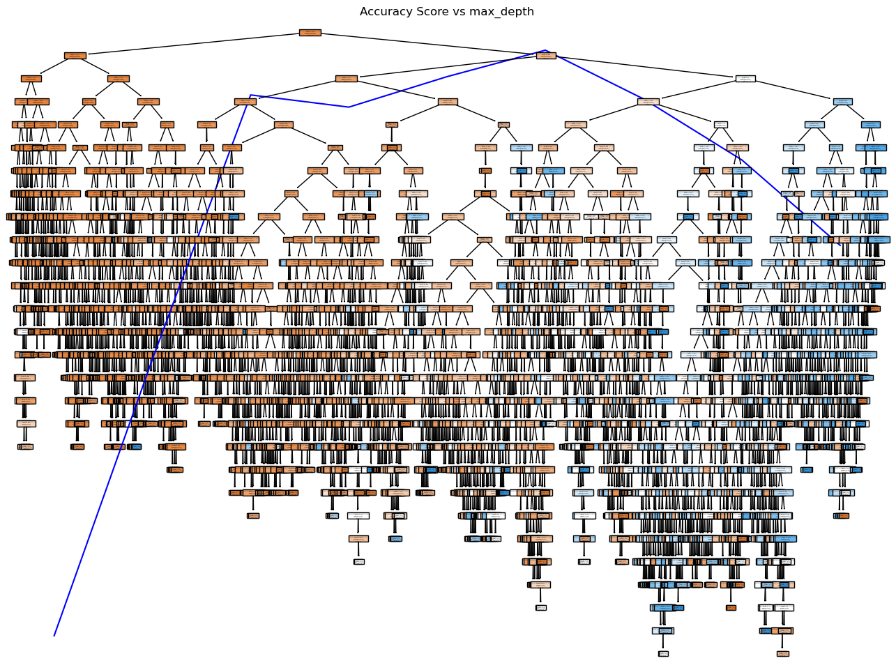
    


    The best max_depth by cross-validation is  6


```python
# set max_depth
dtc = DecisionTreeClassifier(max_depth=5, criterion='entropy',random_state=0) 
dtc_model = dtc.fit(X_train, y_train)

# Visualize classification tree
import matplotlib.pyplot as plt
from sklearn.tree import plot_tree

fn = list(X_train.columns)  # specify feature names
cn = [str(label) for label in dtc_model.classes_]  # convert class labels to strings

plt.figure(figsize=(16, 12))
plot_tree(dtc_model, feature_names=fn, class_names=cn, filled=True, proportion=True);
```


```python
# evaluate in the test data
y_pred=dtc_model.predict(X_test)
print("Plain accuracy of Classification Tree: ",accuracy_score(y_test, y_pred))
```

    Plain accuracy of Classification Tree:  0.9212333994809953


```python
# check the test instance
X_test.iloc[0]
```


    diabetes_mellitus                0.00
    immunosuppression                0.00
    leukemia                         0.00
    lymphoma                         0.00
    solid_tumor_with_metastasis      0.00
    apache_4a_icu_death_prob         0.00
    apache_4a_hospital_death_prob    0.01
    Name: 56291, dtype: float64


```python
# the class probabilies for the first sample in the test data
y_prob=dtc_model.predict_proba(X_test.iloc[[0]])
print(y_prob)
```

    [[0.99757598 0.00242402]]


```python
# Evaluate using the test data
from sklearn.metrics import confusion_matrix
from sklearn.metrics import ConfusionMatrixDisplay

y_pred = dtc_model.predict(X_test)
cm = confusion_matrix(y_test, y_pred, labels=dtc.classes_)
disp = ConfusionMatrixDisplay(confusion_matrix=cm, display_labels=dtc.classes_)
disp.plot()
plt.show()
```


    
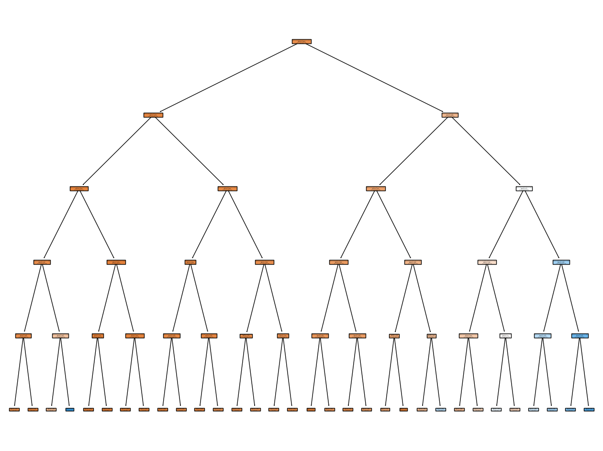
    


    

    


```python
accuracy = accuracy_score(y_test, y_pred)
print("Accuracy:", accuracy)

# Classification report
print("\nClassification Report:")
print(classification_report(y_test, y_pred))
```

    Accuracy: 0.9212333994809953
    
    Classification Report:
                  precision    recall  f1-score   support
    
             0.0       0.93      0.98      0.96     41900
             1.0       0.60      0.25      0.36      3957
    
        accuracy                           0.92     45857
       macro avg       0.77      0.62      0.66     45857
    weighted avg       0.90      0.92      0.91     45857
    


```python
import pandas as pd
from sklearn.model_selection import train_test_split, cross_val_score, KFold  # Import model_selection
from sklearn.linear_model import LogisticRegression
from sklearn.svm import SVC
from sklearn.tree import DecisionTreeClassifier

# Assuming df_project is your DataFrame
y = clean_df['hospital_death']
X = clean_df[['diabetes_mellitus', 'immunosuppression', 'leukemia', 'lymphoma', 'solid_tumor_with_metastasis','apache_4a_icu_death_prob','apache_4a_hospital_death_prob']]

# Splitting the data
X_train, X_test, y_train, y_test = train_test_split(X, y, test_size=0.50, random_state=1324)

# Initialize classifiers in consideration
models = []
models.append(('Logistic Regression', LogisticRegression()))
models.append(('SVC', SVC(kernel='linear')))
models.append(('Decision Tree Classifier', DecisionTreeClassifier(max_depth=5, criterion='entropy', random_state=0)))
models.append(('Gradient Boosting Classifier', GradientBoostingClassifier(random_state=0)))
models.append(('Random Forest Classifier', RandomForestClassifier(random_state=0)))

# Evaluating Model Results:
acc_results = []
auc_results = []
names = []
# set table to table to populate with performance results
col = ['Algorithm', 'AUC Mean', 'AUC STD', 'Accuracy Mean', 'Accuracy STD']
model_results = pd.DataFrame(columns=col)

# Evaluate each model using k-fold cross-validation:
i = 0
for name, model in models:
    kfold = KFold(n_splits=3)  # Use KFold directly from sklearn.model_selection
    # accuracy scoring:
    cv_acc_results = cross_val_score(model, X_train, y_train, cv=kfold, scoring='accuracy')
    # roc_auc scoring:
    cv_auc_results = cross_val_score(model, X_train, y_train, cv=kfold, scoring='roc_auc')
    acc_results.append(cv_acc_results)
    auc_results.append(cv_auc_results)
    names.append(name)
    model_results.loc[i] = [name,
                         round(cv_auc_results.mean()*100, 2),
                         round(cv_auc_results.std()*100, 2),
                         round(cv_acc_results.mean()*100, 2),
                         round(cv_acc_results.std()*100, 2)
                         ]
    i += 1
    
model_results.sort_values(by=['AUC Mean'], ascending=False)
```


<div>
<style scoped>
    .dataframe tbody tr th:only-of-type {
        vertical-align: middle;
    }

    .dataframe tbody tr th {
        vertical-align: top;
    }

    .dataframe thead th {
        text-align: right;
    }
</style>
<table border="1" class="dataframe">
  <thead>
    <tr style="text-align: right;">
      <th></th>
      <th>Algorithm</th>
      <th>AUC Mean</th>
      <th>AUC STD</th>
      <th>Accuracy Mean</th>
      <th>Accuracy STD</th>
    </tr>
  </thead>
  <tbody>
    <tr>
      <th>3</th>
      <td>Gradient Boosting Classifier</td>
      <td>84.32</td>
      <td>0.42</td>
      <td>92.00</td>
      <td>0.13</td>
    </tr>
    <tr>
      <th>2</th>
      <td>Decision Tree Classifier</td>
      <td>83.70</td>
      <td>0.47</td>
      <td>91.94</td>
      <td>0.05</td>
    </tr>
    <tr>
      <th>0</th>
      <td>Logistic Regression</td>
      <td>81.98</td>
      <td>0.32</td>
      <td>92.06</td>
      <td>0.07</td>
    </tr>
    <tr>
      <th>4</th>
      <td>Random Forest Classifier</td>
      <td>78.66</td>
      <td>0.47</td>
      <td>91.17</td>
      <td>0.11</td>
    </tr>
    <tr>
      <th>1</th>
      <td>SVC</td>
      <td>73.98</td>
      <td>3.74</td>
      <td>91.37</td>
      <td>0.08</td>
    </tr>
  </tbody>
</table>
</div>


## Model 4: apache ('apache_4a_hospital_death_prob') 


```python
import pandas as pd
from sklearn.model_selection import train_test_split

# Assuming df_project is your DataFrame
y = clean_df['hospital_death']
X = clean_df[['apache_4a_hospital_death_prob']]

# Splitting the data
X_train, X_test, y_train, y_test = train_test_split(X, y, test_size=0.50, random_state=1324)
```


```python
# fit classification tree
from sklearn.model_selection import cross_val_score
from sklearn.tree import DecisionTreeClassifier
from sklearn.metrics import accuracy_score 

dtc = DecisionTreeClassifier(criterion='entropy', random_state=0) # default setting: criterion='gini'
dtc_model=dtc.fit(X_train,y_train)
```


```python
import matplotlib.pyplot as plt
from sklearn.tree import plot_tree

# Convert class labels to strings
cn = [str(label) for label in dtc_model.classes_]

# Rest of your code
fn = list(X_train.columns)  # Specify feature names

plt.figure(figsize=(16, 12))
plot_tree(dtc_model, feature_names=fn, class_names=cn, filled=True, proportion=True);
```


```python
# evaluate in the test data
y_pred=dtc_model.predict(X_test)
print("Plain accuracy of Classification Tree: ",accuracy_score(y_test, y_pred))
```

    Plain accuracy of Classification Tree:  0.9213642410100966


```python
# tune max_depth
scores_list = []
depth_list = np.arange(1,10,1)
for depth in depth_list:
    dtc = DecisionTreeClassifier(max_depth=depth, criterion='entropy',random_state=0) 
    model=dtc.fit(X_train,y_train)
    scores = cross_val_score(model,X_train,y_train,cv=10,scoring='accuracy') 
    scores_list.append(scores.mean())

plt.plot(depth_list, scores_list,  color = 'blue', markerfacecolor = 'black',label = 'Score')
plt.title('Accuracy Score vs max_depth')
plt.show()

index = np.argmax(np.array(scores_list))
depth_best = depth_list[index]
print('The best max_depth by cross-validation is ', depth_best)
```


    
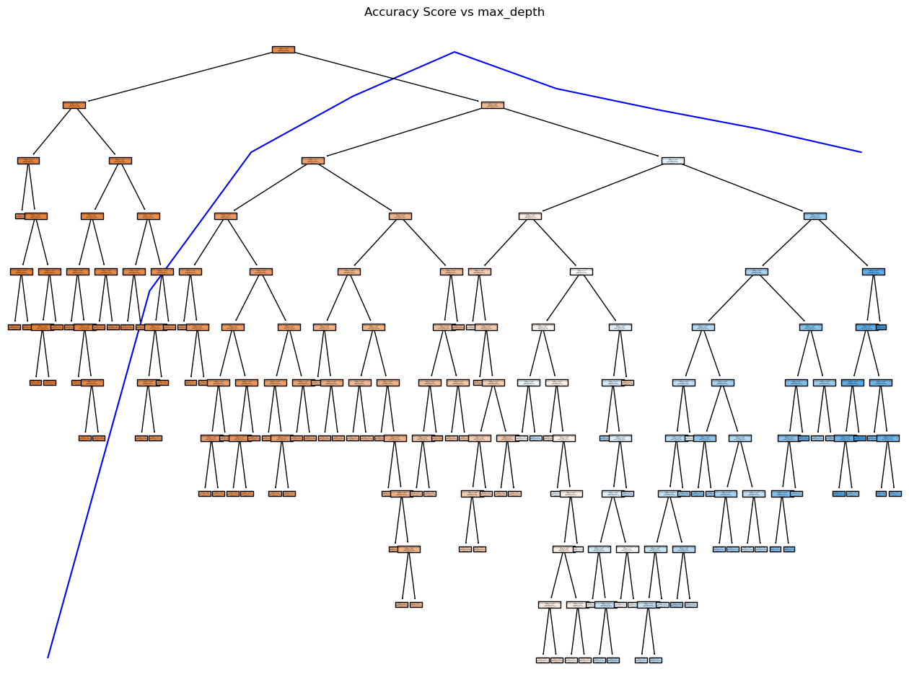
    


    The best max_depth by cross-validation is  5


```python
# set max_depth
dtc = DecisionTreeClassifier(max_depth=5, criterion='entropy',random_state=0) 
dtc_model = dtc.fit(X_train, y_train)

# Visualize classification tree
import matplotlib.pyplot as plt
from sklearn.tree import plot_tree

fn = list(X_train.columns)  # specify feature names
cn = [str(label) for label in dtc_model.classes_]  # convert class labels to strings

plt.figure(figsize=(16, 12))
plot_tree(dtc_model, feature_names=fn, class_names=cn, filled=True, proportion=True);
```


```python
# evaluate in the test data
y_pred=dtc_model.predict(X_test)
print("Plain accuracy of Classification Tree: ",accuracy_score(y_test, y_pred))
```

    Plain accuracy of Classification Tree:  0.921887607126502


```python
# check the test instance
X_test.iloc[0]
```


    apache_4a_hospital_death_prob    0.01
    Name: 56291, dtype: float64


```python
# the class probabilies for the first sample in the test data
y_prob=dtc_model.predict_proba(X_test.iloc[[0]])
print(y_prob)
```

    [[0.99781421 0.00218579]]


```python
# Evaluate using the test data
from sklearn.metrics import confusion_matrix
from sklearn.metrics import ConfusionMatrixDisplay

y_pred = dtc_model.predict(X_test)
cm = confusion_matrix(y_test, y_pred, labels=dtc.classes_)
disp = ConfusionMatrixDisplay(confusion_matrix=cm, display_labels=dtc.classes_)
disp.plot()
plt.show()
```


    
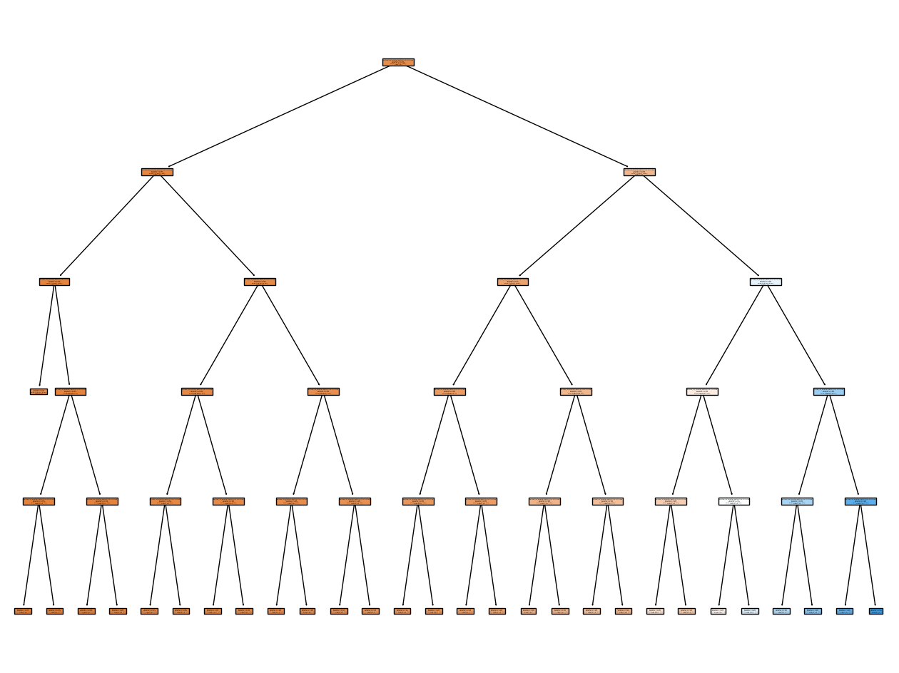
    


    

    


```python
accuracy = accuracy_score(y_test, y_pred)
print("Accuracy:", accuracy)

# Classification report
print("\nClassification Report:")
print(classification_report(y_test, y_pred))
```

    Accuracy: 0.921887607126502
    
    Classification Report:
                  precision    recall  f1-score   support
    
             0.0       0.93      0.99      0.96     41900
             1.0       0.65      0.21      0.31      3957
    
        accuracy                           0.92     45857
       macro avg       0.79      0.60      0.64     45857
    weighted avg       0.91      0.92      0.90     45857
    


```python
import pandas as pd
from sklearn.model_selection import train_test_split, cross_val_score, KFold  # Import model_selection
from sklearn.linear_model import LogisticRegression
from sklearn.svm import SVC
from sklearn.tree import DecisionTreeClassifier

# Assuming df_project is your DataFrame
y = clean_df['hospital_death']
X = clean_df[['apache_4a_hospital_death_prob']]

# Splitting the data
X_train, X_test, y_train, y_test = train_test_split(X, y, test_size=0.50, random_state=1324)

# Initialize classifiers in consideration
models = []
models.append(('Logistic Regression', LogisticRegression()))
models.append(('SVC', SVC(kernel='linear')))
models.append(('Decision Tree Classifier', DecisionTreeClassifier(max_depth=5, criterion='entropy', random_state=0)))
models.append(('Gradient Boosting Classifier', GradientBoostingClassifier(random_state=0)))
models.append(('Random Forest Classifier', RandomForestClassifier(random_state=0)))

# Evaluating Model Results:
acc_results = []
auc_results = []
names = []
# set table to table to populate with performance results
col = ['Algorithm', 'AUC Mean', 'AUC STD', 'Accuracy Mean', 'Accuracy STD']
model_results = pd.DataFrame(columns=col)

# Evaluate each model using k-fold cross-validation:
i = 0
for name, model in models:
    kfold = KFold(n_splits=3)  # Use KFold directly from sklearn.model_selection
    # accuracy scoring:
    cv_acc_results = cross_val_score(model, X_train, y_train, cv=kfold, scoring='accuracy')
    # roc_auc scoring:
    cv_auc_results = cross_val_score(model, X_train, y_train, cv=kfold, scoring='roc_auc')
    acc_results.append(cv_acc_results)
    auc_results.append(cv_auc_results)
    names.append(name)
    model_results.loc[i] = [name,
                         round(cv_auc_results.mean()*100, 2),
                         round(cv_auc_results.std()*100, 2),
                         round(cv_acc_results.mean()*100, 2),
                         round(cv_acc_results.std()*100, 2)
                         ]
    i += 1
    
model_results.sort_values(by=['AUC Mean'], ascending=False)
```


<div>
<style scoped>
    .dataframe tbody tr th:only-of-type {
        vertical-align: middle;
    }

    .dataframe tbody tr th {
        vertical-align: top;
    }

    .dataframe thead th {
        text-align: right;
    }
</style>
<table border="1" class="dataframe">
  <thead>
    <tr style="text-align: right;">
      <th></th>
      <th>Algorithm</th>
      <th>AUC Mean</th>
      <th>AUC STD</th>
      <th>Accuracy Mean</th>
      <th>Accuracy STD</th>
    </tr>
  </thead>
  <tbody>
    <tr>
      <th>3</th>
      <td>Gradient Boosting Classifier</td>
      <td>84.01</td>
      <td>0.44</td>
      <td>92.01</td>
      <td>0.12</td>
    </tr>
    <tr>
      <th>2</th>
      <td>Decision Tree Classifier</td>
      <td>83.90</td>
      <td>0.42</td>
      <td>92.00</td>
      <td>0.13</td>
    </tr>
    <tr>
      <th>4</th>
      <td>Random Forest Classifier</td>
      <td>83.89</td>
      <td>0.42</td>
      <td>91.94</td>
      <td>0.11</td>
    </tr>
    <tr>
      <th>0</th>
      <td>Logistic Regression</td>
      <td>82.57</td>
      <td>0.49</td>
      <td>92.04</td>
      <td>0.08</td>
    </tr>
    <tr>
      <th>1</th>
      <td>SVC</td>
      <td>17.43</td>
      <td>0.49</td>
      <td>91.37</td>
      <td>0.08</td>
    </tr>
  </tbody>
</table>
</div>


## Model 5: apache based (apache_4a_icu_death_prob)


```python
import pandas as pd
from sklearn.model_selection import train_test_split

# Assuming df_project is your DataFrame
y = clean_df['hospital_death']
X = clean_df[['apache_4a_icu_death_prob']]

# Splitting the data
X_train, X_test, y_train, y_test = train_test_split(X, y, test_size=0.50, random_state=1324)
```


```python
# fit classification tree
from sklearn.model_selection import cross_val_score
from sklearn.tree import DecisionTreeClassifier
from sklearn.metrics import accuracy_score 

dtc = DecisionTreeClassifier(criterion='entropy', random_state=0) # default setting: criterion='gini'
dtc_model=dtc.fit(X_train,y_train)
```


```python
import matplotlib.pyplot as plt
from sklearn.tree import plot_tree

# Convert class labels to strings
cn = [str(label) for label in dtc_model.classes_]

# Rest of your code
fn = list(X_train.columns)  # Specify feature names

plt.figure(figsize=(16, 12))
plot_tree(dtc_model, feature_names=fn, class_names=cn, filled=True, proportion=True);
```


```python
# evaluate in the test data
y_pred=dtc_model.predict(X_test)
print("Plain accuracy of Classification Tree: ",accuracy_score(y_test, y_pred))
```

    Plain accuracy of Classification Tree:  0.9212115925594784


```python
# tune max_depth
scores_list = []
depth_list = np.arange(1,11,1)
for depth in depth_list:
    dtc = DecisionTreeClassifier(max_depth=depth, criterion='entropy',random_state=0) 
    model=dtc.fit(X_train,y_train)
    scores = cross_val_score(model,X_train,y_train,cv=10,scoring='accuracy') 
    scores_list.append(scores.mean())

plt.plot(depth_list, scores_list,  color = 'blue', markerfacecolor = 'black',label = 'Score')
plt.title('Accuracy Score vs max_depth')
plt.show()

index = np.argmax(np.array(scores_list))
depth_best = depth_list[index]
print('The best max_depth by cross-validation is ', depth_best)
```


    
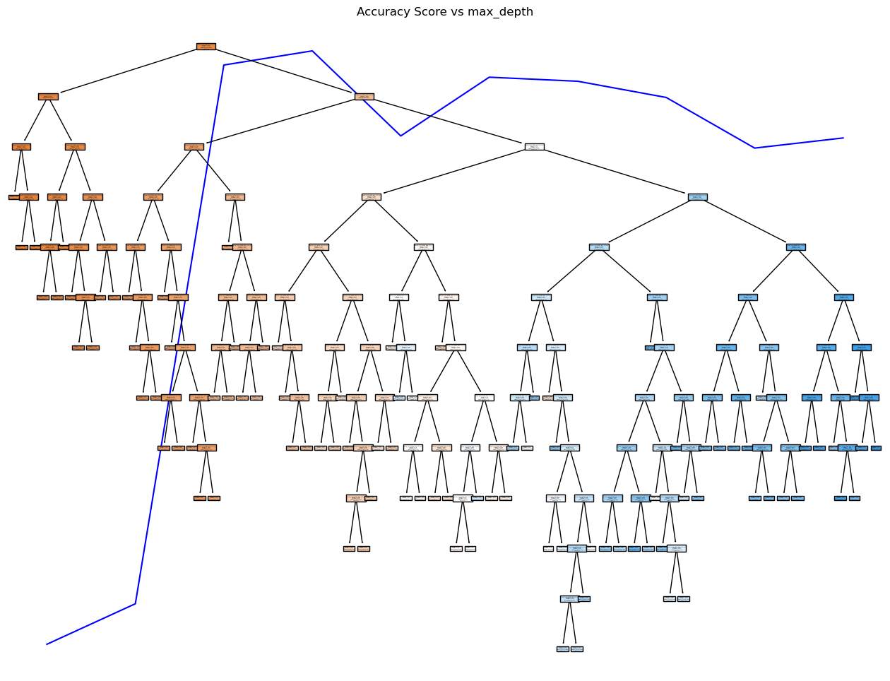
    


    The best max_depth by cross-validation is  4


```python
# set max_depth
dtc = DecisionTreeClassifier(max_depth=5, criterion='entropy',random_state=0) 
dtc_model = dtc.fit(X_train, y_train)

# Visualize classification tree
import matplotlib.pyplot as plt
from sklearn.tree import plot_tree

fn = list(X_train.columns)  # specify feature names
cn = [str(label) for label in dtc_model.classes_]  # convert class labels to strings

plt.figure(figsize=(16, 12))
plot_tree(dtc_model, feature_names=fn, class_names=cn, filled=True, proportion=True);
```


```python
# evaluate in the test data
y_pred=dtc_model.predict(X_test)
print("Plain accuracy of Classification Tree: ",accuracy_score(y_test, y_pred))
```

    Plain accuracy of Classification Tree:  0.9208408748936913


```python
# check the test instance
X_test.iloc[0]
```


    apache_4a_icu_death_prob    0.0
    Name: 56291, dtype: float64


```python
# the class probabilies for the first sample in the test data
y_prob=dtc_model.predict_proba(X_test.iloc[[0]])
print(y_prob)
```

    [[0.9979266 0.0020734]]


```python
# Evaluate using the test data
from sklearn.metrics import confusion_matrix
from sklearn.metrics import ConfusionMatrixDisplay

y_pred = dtc_model.predict(X_test)
cm = confusion_matrix(y_test, y_pred, labels=dtc.classes_)
disp = ConfusionMatrixDisplay(confusion_matrix=cm, display_labels=dtc.classes_)
disp.plot()
plt.show()
```


    
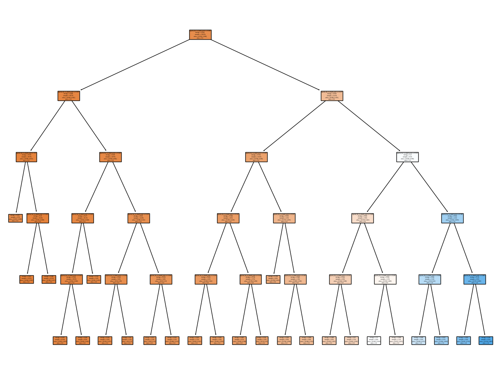
    


    

    


```python
accuracy = accuracy_score(y_test, y_pred)
print("Accuracy:", accuracy)

# Classification report
print("\nClassification Report:")
print(classification_report(y_test, y_pred))
```

    Accuracy: 0.9208408748936913
    
    Classification Report:
                  precision    recall  f1-score   support
    
             0.0       0.93      0.99      0.96     41900
             1.0       0.63      0.20      0.30      3957
    
        accuracy                           0.92     45857
       macro avg       0.78      0.59      0.63     45857
    weighted avg       0.90      0.92      0.90     45857
    


```python
import pandas as pd
from sklearn.model_selection import train_test_split, cross_val_score, KFold
from sklearn.linear_model import LogisticRegression
from sklearn.svm import SVC
from sklearn.tree import DecisionTreeClassifier
from sklearn.ensemble import GradientBoostingClassifier, RandomForestClassifier

# Assuming df_project is your DataFrame
y = clean_df['hospital_death']
X = clean_df[['apache_4a_icu_death_prob']]

# Splitting the data
X_train, X_test, y_train, y_test = train_test_split(X, y, test_size=0.50, random_state=1324)

# Initialize classifiers in consideration
models = []
models.append(('Logistic Regression', LogisticRegression()))
models.append(('SVC', SVC(kernel='linear')))
models.append(('Decision Tree Classifier', DecisionTreeClassifier(max_depth=5, criterion='entropy', random_state=0)))
models.append(('Gradient Boosting Classifier', GradientBoostingClassifier(random_state=0)))
models.append(('Random Forest Classifier', RandomForestClassifier(random_state=0)))

# Evaluating Model Results:
acc_results = []
auc_results = []
names = []
# set table to table to populate with performance results
col = ['Algorithm', 'AUC Mean', 'AUC STD', 'Accuracy Mean', 'Accuracy STD']
model_results = pd.DataFrame(columns=col)

# Evaluate each model using k-fold cross-validation:
i = 0
for name, model in models:
    kfold = KFold(n_splits=3)  # Use KFold directly from sklearn.model_selection
    # accuracy scoring:
    cv_acc_results = cross_val_score(model, X_train, y_train, cv=kfold, scoring='accuracy')
    # roc_auc scoring:
    cv_auc_results = cross_val_score(model, X_train, y_train, cv=kfold, scoring='roc_auc')
    acc_results.append(cv_acc_results)
    auc_results.append(cv_auc_results)
    names.append(name)
    model_results.loc[i] = [name,
                         round(cv_auc_results.mean()*100, 2),
                         round(cv_auc_results.std()*100, 2),
                         round(cv_acc_results.mean()*100, 2),
                         round(cv_acc_results.std()*100, 2)
                         ]
    i += 1
    
model_results.sort_values(by=['AUC Mean'], ascending=False)

```


<div>
<style scoped>
    .dataframe tbody tr th:only-of-type {
        vertical-align: middle;
    }

    .dataframe tbody tr th {
        vertical-align: top;
    }

    .dataframe thead th {
        text-align: right;
    }
</style>
<table border="1" class="dataframe">
  <thead>
    <tr style="text-align: right;">
      <th></th>
      <th>Algorithm</th>
      <th>AUC Mean</th>
      <th>AUC STD</th>
      <th>Accuracy Mean</th>
      <th>Accuracy STD</th>
    </tr>
  </thead>
  <tbody>
    <tr>
      <th>3</th>
      <td>Gradient Boosting Classifier</td>
      <td>83.46</td>
      <td>0.28</td>
      <td>91.96</td>
      <td>0.11</td>
    </tr>
    <tr>
      <th>2</th>
      <td>Decision Tree Classifier</td>
      <td>83.44</td>
      <td>0.28</td>
      <td>92.02</td>
      <td>0.12</td>
    </tr>
    <tr>
      <th>4</th>
      <td>Random Forest Classifier</td>
      <td>83.42</td>
      <td>0.29</td>
      <td>91.89</td>
      <td>0.06</td>
    </tr>
    <tr>
      <th>0</th>
      <td>Logistic Regression</td>
      <td>82.21</td>
      <td>0.21</td>
      <td>92.05</td>
      <td>0.09</td>
    </tr>
    <tr>
      <th>1</th>
      <td>SVC</td>
      <td>60.68</td>
      <td>30.39</td>
      <td>91.37</td>
      <td>0.08</td>
    </tr>
  </tbody>
</table>
</div>


## Model 6: apache based (apache_4a_hospital_death_prob, apache_4a_icu_death_prob)


```python
import pandas as pd
from sklearn.model_selection import train_test_split

# Assuming df_project is your DataFrame
y = clean_df['hospital_death']
X = clean_df[['apache_4a_hospital_death_prob', 'apache_4a_icu_death_prob']]

# Splitting the data
X_train, X_test, y_train, y_test = train_test_split(X, y, test_size=0.50, random_state=1324)
```


```python
# fit classification tree
from sklearn.model_selection import cross_val_score
from sklearn.tree import DecisionTreeClassifier
from sklearn.metrics import accuracy_score 

dtc = DecisionTreeClassifier(criterion='entropy', random_state=0) # default setting: criterion='gini'
dtc_model=dtc.fit(X_train,y_train)
```


```python
import matplotlib.pyplot as plt
from sklearn.tree import plot_tree

# Convert class labels to strings
cn = [str(label) for label in dtc_model.classes_]

# Rest of your code
fn = list(X_train.columns)  # Specify feature names

plt.figure(figsize=(16, 12))
plot_tree(dtc_model, feature_names=fn, class_names=cn, filled=True, proportion=True);
```


```python
# evaluate in the test data
y_pred=dtc_model.predict(X_test)
print("Plain accuracy of Classification Tree: ",accuracy_score(y_test, y_pred))
```

    Plain accuracy of Classification Tree:  0.9161741936890769


```python
# tune max_depth
scores_list = []
depth_list = np.arange(1,10,1)
for depth in depth_list:
    dtc = DecisionTreeClassifier(max_depth=depth, criterion='entropy',random_state=0) 
    model=dtc.fit(X_train,y_train)
    scores = cross_val_score(model,X_train,y_train,cv=10,scoring='accuracy') 
    scores_list.append(scores.mean())

plt.plot(depth_list, scores_list,  color = 'blue', markerfacecolor = 'black',label = 'Score')
plt.title('Accuracy Score vs max_depth')
plt.show()

index = np.argmax(np.array(scores_list))
depth_best = depth_list[index]
print('The best max_depth by cross-validation is ', depth_best)
```


    
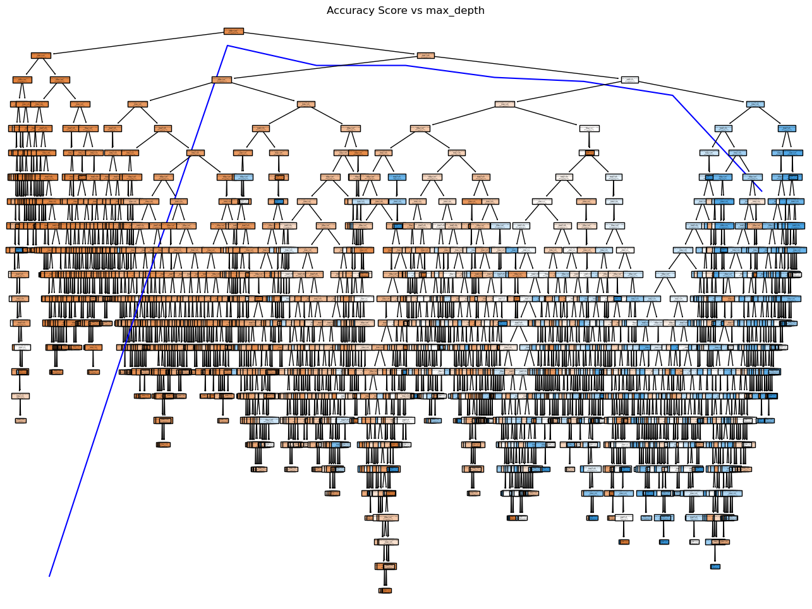
    


    The best max_depth by cross-validation is  3


```python
# set max_depth
dtc = DecisionTreeClassifier(max_depth=6, criterion='entropy',random_state=0) 
dtc_model = dtc.fit(X_train, y_train)

# Visualize classification tree
import matplotlib.pyplot as plt
from sklearn.tree import plot_tree

fn = list(X_train.columns)  # specify feature names
cn = [str(label) for label in dtc_model.classes_]  # convert class labels to strings

plt.figure(figsize=(16, 12))
plot_tree(dtc_model, feature_names=fn, class_names=cn, filled=True, proportion=True);
```


```python
# evaluate in the test data
y_pred=dtc_model.predict(X_test)
print("Plain accuracy of Classification Tree: ",accuracy_score(y_test, y_pred))
```

    Plain accuracy of Classification Tree:  0.9217349586758837


```python
# check the test instance
X_test.iloc[0]
```


    apache_4a_hospital_death_prob    0.01
    apache_4a_icu_death_prob         0.00
    Name: 56291, dtype: float64


```python
# the class probabilies for the first sample in the test data
y_prob=dtc_model.predict_proba(X_test.iloc[[0]])
print(y_prob)
```

    [[0.99807074 0.00192926]]


```python
# Evaluate using the test data
from sklearn.metrics import confusion_matrix
from sklearn.metrics import ConfusionMatrixDisplay

y_pred = dtc_model.predict(X_test)
cm = confusion_matrix(y_test, y_pred, labels=dtc.classes_)
disp = ConfusionMatrixDisplay(confusion_matrix=cm, display_labels=dtc.classes_)
disp.plot()
plt.show()
```


    
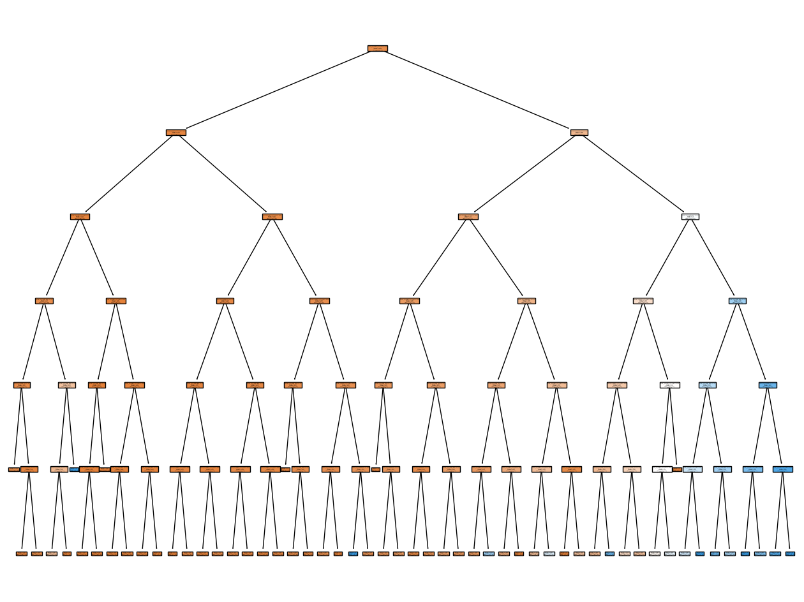
    


    
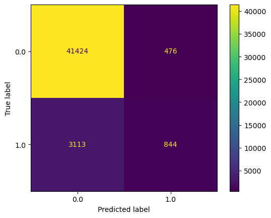
    


```python
accuracy = accuracy_score(y_test, y_pred)
print("Accuracy:", accuracy)

# Classification report
print("\nClassification Report:")
print(classification_report(y_test, y_pred))
```

    Accuracy: 0.9217349586758837
    
    Classification Report:
                  precision    recall  f1-score   support
    
             0.0       0.93      0.99      0.96     41900
             1.0       0.64      0.21      0.32      3957
    
        accuracy                           0.92     45857
       macro avg       0.78      0.60      0.64     45857
    weighted avg       0.91      0.92      0.90     45857
    


```python
import pandas as pd
from sklearn.model_selection import train_test_split, cross_val_score, KFold
from sklearn.linear_model import LogisticRegression
from sklearn.svm import SVC
from sklearn.tree import DecisionTreeClassifier
from sklearn.ensemble import GradientBoostingClassifier, RandomForestClassifier

# Assuming df_project is your DataFrame
y = clean_df['hospital_death']
X = clean_df[['apache_4a_hospital_death_prob', 'apache_4a_icu_death_prob']]

# Splitting the data
X_train, X_test, y_train, y_test = train_test_split(X, y, test_size=0.50, random_state=1324)

# Initialize classifiers in consideration
models = []
models.append(('Logistic Regression', LogisticRegression()))
models.append(('SVC', SVC(kernel='linear')))
models.append(('Decision Tree Classifier', DecisionTreeClassifier(max_depth=6, criterion='entropy', random_state=0)))
models.append(('Gradient Boosting Classifier', GradientBoostingClassifier(random_state=0)))
models.append(('Random Forest Classifier', RandomForestClassifier(random_state=0)))

# Evaluating Model Results:
acc_results = []
auc_results = []
names = []
# set table to table to populate with performance results
col = ['Algorithm', 'AUC Mean', 'AUC STD', 'Accuracy Mean', 'Accuracy STD']
model_results = pd.DataFrame(columns=col)

# Evaluate each model using k-fold cross-validation:
i = 0
for name, model in models:
    kfold = KFold(n_splits=3)  # Use KFold directly from sklearn.model_selection
    # accuracy scoring:
    cv_acc_results = cross_val_score(model, X_train, y_train, cv=kfold, scoring='accuracy')
    # roc_auc scoring:
    cv_auc_results = cross_val_score(model, X_train, y_train, cv=kfold, scoring='roc_auc')
    acc_results.append(cv_acc_results)
    auc_results.append(cv_auc_results)
    names.append(name)
    model_results.loc[i] = [name,
                         round(cv_auc_results.mean()*100, 2),
                         round(cv_auc_results.std()*100, 2),
                         round(cv_acc_results.mean()*100, 2),
                         round(cv_acc_results.std()*100, 2)
                         ]
    i += 1
    
model_results.sort_values(by=['AUC Mean'], ascending=False)
```


<div>
<style scoped>
    .dataframe tbody tr th:only-of-type {
        vertical-align: middle;
    }

    .dataframe tbody tr th {
        vertical-align: top;
    }

    .dataframe thead th {
        text-align: right;
    }
</style>
<table border="1" class="dataframe">
  <thead>
    <tr style="text-align: right;">
      <th></th>
      <th>Algorithm</th>
      <th>AUC Mean</th>
      <th>AUC STD</th>
      <th>Accuracy Mean</th>
      <th>Accuracy STD</th>
    </tr>
  </thead>
  <tbody>
    <tr>
      <th>3</th>
      <td>Gradient Boosting Classifier</td>
      <td>84.22</td>
      <td>0.40</td>
      <td>91.93</td>
      <td>0.09</td>
    </tr>
    <tr>
      <th>2</th>
      <td>Decision Tree Classifier</td>
      <td>83.63</td>
      <td>0.49</td>
      <td>91.96</td>
      <td>0.10</td>
    </tr>
    <tr>
      <th>0</th>
      <td>Logistic Regression</td>
      <td>82.51</td>
      <td>0.48</td>
      <td>92.03</td>
      <td>0.08</td>
    </tr>
    <tr>
      <th>4</th>
      <td>Random Forest Classifier</td>
      <td>79.48</td>
      <td>0.19</td>
      <td>91.30</td>
      <td>0.05</td>
    </tr>
    <tr>
      <th>1</th>
      <td>SVC</td>
      <td>58.13</td>
      <td>28.79</td>
      <td>91.37</td>
      <td>0.08</td>
    </tr>
  </tbody>
</table>
</div>


